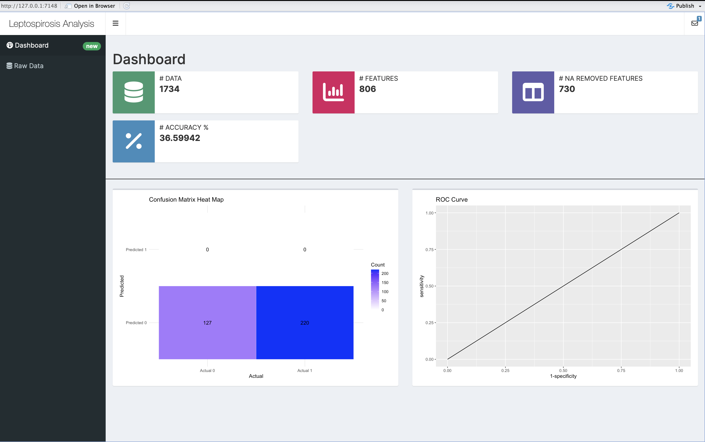
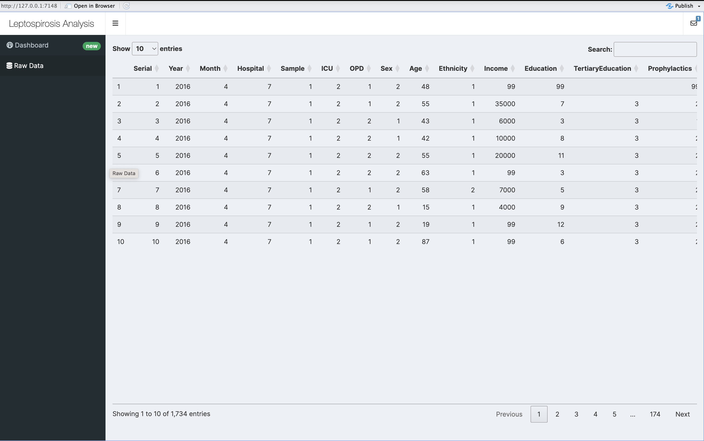

# Task 1

In this task we need to analyze the **SriLanka_Weather_Dataset.csv** and generate important plots that will provide important aspects of the data set.

First, let's import the necessary libraries.

```{r}
# Import libraries
## Plots
library(ggplot2)

## Data manipulation
library(dplyr)
```

Next let's load the **SriLanka_Weather_Dataset.csv** data set and check the data in the data set.

```{r}
# Load the data set
data <-
  read.csv(
    "/Users/nipunaupeksha/Documents/Nipuna/CMM703/datasets/SriLanka_Weather_Dataset.csv"
  )

# Output the first few rows of the data set
head(data)
```

Next, let's try to understand the data set by checking what are the numerical and categorical columns in the data set.

```{r}
# Understand the data set
print(str(data))
```

Next, let's find the dimension of the data set.

```{r}
# Find the dimensions of the data set
dim(data)
```

Next, we need to find out whether there are any missing or null value data in the data set. Since we have both numerical and categorical data, we need to address both of them.

```{r}
# Check for missing numerical values
missing_numerical <- colSums(is.na(data[sapply(data, is.numeric)]))

# Print columns with missing numerical values
print(missing_numerical)
```

```{r}
# Check for missing categorical values
categorical_data <-
  data[sapply(data, function(x)
    is.character(x) | is.factor(x))]
missing_categorical <- colSums(sapply(categorical_data, function(x) {
  is.na(x) |
    (is.character(x) |
       is.factor(x)) &
    trimws(as.character(
      x,
      which = c("both", "left", "right"),
      whitespace = "[ \t\r\n]"
    )) == ""
}))

# Print columns with missing categorical values
print(missing_categorical)
```

But, we need to find out whether there are any values or empty values by finding the count of unique values in each of the columns. To do that we can use the following function.

```{r}
unique_values_counts <- function(data) {
  for (col in names(data)) {
    counts <- table(data[[col]])  # Get counts of each unique value
    counts["NA"] <-
      sum(is.na(data[[col]])) # Include the count of NA values
    
    print(col) # Print the column name
    print(counts) # Print the unique values
  }
}
```

Next, let's get the unique values of each column. To do that we can execute the following code block.

```{r}
# Execute the unique_value_counts function to find the unique values
unique_values_counts(data)
```

As we can note, there are no NA or missing values in the data set. Therefore, we can plot some unique graphs for the data set.

### Temperature Trends in a Specific City

We can find the temperature trends in each city. For example, if we need to find the temperature trends in Colombo to analyze how it changed over time, we can check it with the following plot.

```{r}
# Filter data for Colombo city
colombo_data <- subset(data, city == "Colombo")

# Convert 'time' column to Date format
colombo_data$time <- as.Date(colombo_data$time)
# Create the plot for temperature trends
ggplot(colombo_data, aes(x = time, y = temperature_2m_mean)) +
  geom_line() +
  labs(title = "Temperature Trends in Colombo",
       x = "Date",
       y = "Mean Temperature (°C)") +
  theme_minimal()
```

### Precipitation vs. Temperature in a Specific City

Since the temperature trends depends on precipitation, it is important to have a good idea about how temperature changes with the precipitation. We can check that with a specific city to understand how it impacted on it.

```{r}
ggplot(colombo_data,
       aes(x = precipitation_sum, y = temperature_2m_mean)) +
  geom_point() +
  labs(title = "Precipitation vs. Temperature in Colombo",
       x = "Precipitation (mm)",
       y = "Mean Temperature (°C)") +
  theme_minimal()
```

### Temperature Distributions in Each City

Since we have a way to analyze the temperature trends of each city, it is important to look at all the cities and get an idea about how the temperature was disctirbuted over past years. To do that, we can use the following plot.

```{r}
ggplot(data, aes(x = city, y = temperature_2m_mean, color = city)) +
  geom_boxplot() +
  labs(title = "Temperature Distribution Across Cities",
       x = "City",
       y = "Mean Temperature (°C)") +
  theme_minimal() +
  theme(axis.text.x = element_text(angle = 45, hjust = 1))
```

### Wind Speed Frequencies in a Specific City

Wind speed is another weather metric that needs to be looked at since it accounts for showers and dire natural occurrences. We can check wind speed frequencies in a specific city using the following code block.

```{r}
ggplot(colombo_data, aes(x = windspeed_10m_max)) +
  geom_histogram(binwidth = 1,
                 fill = "skyblue",
                 color = "black") +
  labs(title = "Distribution of Maximum Wind Speed in Colombo",
       x = "Maximum Wind Speed (m/s)",
       y = "Frequency") +
  theme_minimal()
```

### Precipitation Sum by City

As mentioned, precipitation helps us to understand many aspects of weather. And combining the precipitations over the cites helps us to understand which areas are sufferring from droughts and which areas are sufferring from huge showers.

```{r}
ggplot(data, aes(x = city, y = precipitation_sum)) +
  geom_bar(stat = "identity", fill = "skyblue") +
  labs(title = "Total Precipitation Sum by City",
       x = "City",
       y = "Precipitation Sum (mm)") +
  theme_minimal() +
  theme(axis.text.x = element_text(angle = 45, hjust = 1))
```

### Temperature Trends over Time

We can check the temperature trends over time to the understand how the maximum and minimum temperature varied over the time and how it can affect with the global warming.

```{r}
# Convert 'time' column to datetime format
data$time <- as.Date(data$time)
# Plot time series of temperature trends
ggplot(data, aes(x = time)) +
  geom_line(aes(y = temperature_2m_max, color = "Max Temperature"),
            linewidth = 1) +
  geom_line(aes(y = temperature_2m_min, color = "Min Temperature"),
            linewidth = 1) +
  geom_line(aes(y = temperature_2m_mean, color = "Mean Temperature"),
            linewidth = 1) +
  labs(
    title = "Temperature Trends Over Time",
    x = "Date",
    y = "Temperature (°C)",
    color = "Variable"
  ) +
  theme_minimal()
```

### Improving the Plots

To enhance the outputs generated by these plots, we can consider the following.

-   Adding smoother qnd trend lines to the plots for better trend visualization and exploratory data analysis.
-   Using grids to create separate plots for each city, allowing the user to compare the differences between cities.
-   Adding annotations or labels to highlight notable weather events or anomalies.
-   Formatting the axis labels, titles, and legends for further clarity.
-   Exploring interactive plotting libraries like Plotly (Native JS) for interactive capabilities.
-   Customizing feature columns and introducing new features to provide better trends over the time.

# Task 2

In this task, we need to analyze and build a predictive model to predict whether a person has **Leptospirosis** using **lepto_data.csv** file.

First, let's import the necessary libraries.

```{r}
# Import libraries
# Plots
library(ggplot2)
library(gplots)
library(corrplot)
library(cowplot)

# Data manipulation
library(dplyr)
library(tidyr)
library(VIM)
library(pROC)

# Model interpretation
library(caret)
```

Next, let's load the `lepto_data.csv` data set.

```{r}
# Read the data set
data <-
  read.csv("/Users/nipunaupeksha/Documents/Nipuna/CMM703/datasets/lepto_data.csv")

# Output the first few rows of the data set
head(data)
```

## Task 2.1 - Identifying patterns and potential significant variables

Next, let's understand the data set by checking it out.

```{r}
print(str(data))
```

First, let's see the NA or missing values in numerical data in the data set.

```{r}
# Check for missing numerical values
missing_numerical <- colSums(is.na(data[sapply(data, is.numeric)]))

# Print columns with missing numerical values
print(missing_numerical)
```

Now, let's see the NA or missing values in categorical data in the data set.

```{r}
# Check for missing categorical values
categorical_data <-
  data[sapply(data, function(x)
    is.character(x) | is.factor(x))]
missing_categorical <-
  colSums(sapply(categorical_data, function(x) {
    is.na(x) | (is.character(x) | is.factor(x)) &
      trimws(as.character(
        x,
        which = c("both", "left", "right"),
        whitespace = "[ \t\r\n]"
      )) == ""
  }))

# Print columns with missing categorical values
print(missing_categorical)
```

Now, let's check the unique value counts for each of the column and get an idea about the data set. We can use the following function to get the count of each unique value in the data set.

```{r}
unique_values_counts <- function(data) {
  for (col in names(data)) {
    counts <- table(data[[col]])  # Get counts of each unique value
    counts["NA"] <-
      sum(is.na(data[[col]])) # Include count of NA values
    
    print(col) # Print the column name
    print(counts) # Print the unique values
  }
}
```

Since there are considerable number of columns(806) are in this data set, we will run this with chunks containing \~50 columns.

```{r}
# First chunk
unique_values_counts(data[c(0:50)])
```

```{r}
# Second chunk
unique_values_counts(data[c(51:100)])
```

```{r}
# Third chunk
unique_values_counts(data[c(101:150)])
```

```{r}
# Fourth chunk
unique_values_counts(data[c(151:200)])
```

```{r}
# Fifth chunk
unique_values_counts(data[c(201:250)])
```

```{r}
# Sixth chunk
unique_values_counts(data[c(251:300)])
```

```{r}
# Seventh chunk
unique_values_counts(data[c(301:350)])
```

```{r}
# Eighth chunk
unique_values_counts(data[c(351:400)])
```

```{r}
# Ninth chunk
unique_values_counts(data[c(401:450)])
```

```{r}
# Tenth chunk
unique_values_counts(data[c(451:500)])
```

```{r}
# Eleventh chunk
unique_values_counts(data[c(501:550)])
```

```{r}
# Twelfth chunk
unique_values_counts(data[c(551:600)])
```

```{r}
# Thirteenth chunk
unique_values_counts(data[c(601:650)])
```

```{r}
# Fourteenth chunk
unique_values_counts(data[c(651:700)])
```

```{r}
# Fifteenth chunk
unique_values_counts(data[c(701:750)])
```

```{r}
# Sixteenth chunk
unique_values_counts(data[c(751:806)])
```

As we can see there are lot of 99 in the data set. And it means that 99 is an NA value because 99 value is not accounted for the label values **lepto_description.xls** file.

First, let's change the categorical values to numerical values by adding the value 99 for string values in them. If we run the following code block we can identify what are the categorical values in the data set.

```{r}
missing_categorical
```

Since we now know the categorical values in the data set, we can simply use the following three functions to remove the string values and return the features in to numerical values.

```{r}
# Convert Recells in the data set
convert_redcells <- function(data) {
  redcells_cols <-
    grep("^Redcells", names(data), value = TRUE)  # Find columns starting with "Redcells"
  
  for (col in redcells_cols) {
    # Convert to character type
    data[[col]] <- as.character(data[[col]])
    # Replace "Field full" & "Occasional" & empty strings with 99
    data[[col]] <-
      ifelse(grepl("Field", data[[col]], ignore.case = TRUE), 99, data[[col]])
    data[[col]] <-
      ifelse(grepl("occ", data[[col]], ignore.case = TRUE), 99, data[[col]])
    data[[col]] <-
      ifelse(grepl(" ", data[[col]], ignore.case = TRUE), 99, data[[col]])
    # Convert to numeric, replacing any non-numeric values with NA
    data[[col]] <- as.numeric(data[[col]])
  }
  return(data)
}

# Convert the Puscells in the data set
convert_puscells <- function(data) {
  puscell_cols <-
    grep("^Puscells", names(data), value = TRUE)  # Find columns starting with "Puscells"
  
  for (col in puscell_cols) {
    # Convert to character type
    data[[col]] <- as.character(data[[col]])
    # Replace "Field full" with 99
    data[[col]] <-
      ifelse(grepl("Field", data[[col]], ignore.case = TRUE), 99, data[[col]])
    # Convert to numeric, replacing any non-numeric values with NA
    data[[col]] <- as.numeric(data[[col]])
  }
  return(data)
}

# Convert the Pulse Rhythem in the data set
convert_pulserhythem <- function(data) {
  pulserhythem_cols <-
    grep("PulseRhythem", names(data), value = TRUE)  # Find columns starting with "PulseRhythem"
  
  for (col in pulserhythem_cols) {
    # Convert to character type
    data[[col]] <- as.character(data[[col]])
    # Replace "Regular" with 99
    data[[col]] <-
      ifelse(grepl("Regular", data[[col]], ignore.case = TRUE), 99, data[[col]])
    # Replace "SVT" with 99
    data[[col]] <-
      ifelse(grepl("SVT", data[[col]], ignore.case = TRUE), 99, data[[col]])
    # Convert to numeric, replacing any non-numeric values with NA
    data[[col]] <- as.numeric(data[[col]])
  }
  return(data)
}
```

Apply conversions and verify.

```{r}
# Apply conversions
data <- convert_redcells(data)
data <- convert_puscells(data)
data <- convert_pulserhythem(data)

# Check the data types of the columns
redcells_cols <- grep("^Redcells", names(data), value = TRUE)
puscell_cols <- grep("^Puscells", names(data), value = TRUE)
pulserhythem_cols <- grep("PulseRhythem", names(data), value = TRUE)
combined_columns <-
  c(redcells_cols, puscell_cols, pulserhythem_cols)
print(str(data[, combined_columns]))
```

Let's convert every 99 value to NA value except for the 99 value in `Serial` column since in our data set `Serial` column acts as the ID column.

```{r}
data <- data %>%
  mutate(across(-Serial, ~ ifelse(. == 99, NA, .)))
```

Since we do not need `Serial` column for future computations, we can drop the `Serial` column as well.

```{r}
data <- subset(data, select = -c(Serial))
```

First, let's take the column names that has `onset + 2-10th day + admission` record values and put them into a separate columns.

```{r}
headache_columns = c(
  "Headacheonset",
  "Headache2",
  "Headache3",
  "Headache4",
  "Headache5",
  "Headache6",
  "Headache7",
  "Headache8",
  "Headache9",
  "Headache10",
  "Headachead"
)

fever_columns = c(
  "Feveronset",
  "Fever2",
  "Fever3",
  "Fever4",
  "Fever5",
  "Fever6",
  "Fever7",
  "Fever8",
  "Fever9",
  "Fever10",
  "Feverad"
)

chills_columns = c(
  "Chillsonset",
  "Chills2",
  "Chills3",
  "Chills4",
  "Chills5",
  "Chills6",
  "Chills7",
  "Chills8",
  "Chills9",
  "Chills10",
  "Chillsad"
)

rigors_columns = c(
  "Rigorsonset",
  "Rigors2",
  "Rigors3",
  "Rigors4",
  "Rigors5",
  "Rigors6",
  "Rigors7",
  "Rigors8",
  "Rigors9",
  "Rigors10",
  "Rigorsad"
)

musclepain_columns = c(
  "Musclepainonset",
  "Musclepain2",
  "Musclepain3",
  "Musclepain4",
  "Musclepain5",
  "Musclepain6",
  "Musclepain7",
  "Musclepain8",
  "Musclepain9",
  "Musclepain10",
  "Musclepainad"
)

muscletender_columns = c(
  "Muscletendernessonset",
  "Mustender2",
  "Mustender3",
  "Mustender4",
  "Mustender5",
  "Mustender6",
  "Mustender7",
  "Mustender8",
  "Mustender9",
  "Mustender10",
  "Muscletendernessad"
)

nausea_columns = c(
  "Nauseaonset",
  "Nausea2",
  "Nausea3",
  "Nausea4",
  "Nausea5",
  "Nausea6",
  "Nausea7",
  "Nausea8",
  "Nausea9",
  "Nausea10",
  "Nauseaad"
)

vomiting_columns = c(
  "Vomitingonset",
  "Vomiting2",
  "Vomiting3",
  "Vomiting4",
  "Vomiting5",
  "Vomiting6",
  "Vomiting7",
  "Vomiting8",
  "Vomiting9",
  "Vomiting10",
  "Vomitingadmission"
)

cnsuf_columns = c(
  "Cnsuffusiononset",
  "Consuf2",
  "Consuf3",
  "Consuf4",
  "Consuf5",
  "Consuf6",
  "Consuf7",
  "Consuf8",
  "Consuf9",
  "Consuf10",
  "Cnsuffusionad"
)

skinrash_columns = c(
  "Skinrashonset",
  "Skinrash2",
  "Skinrash3",
  "Skinrash4",
  "Skinrash5",
  "Skinrash6",
  "Skinrash7",
  "Skinrash8",
  "Skinrash9",
  "Skinrash10",
  "Skinrashad"
)

mucorash_columns = c(
  "Mucosalrashonset",
  "Mucorash2",
  "Mucorash3",
  "Mucorash4",
  "Mucorash5",
  "Mucorash6",
  "Mucorash7",
  "Mucorash8",
  "Mucorash9",
  "Mucorash10",
  "Mucosalrashad"
)

prostration_columns = c(
  "Prostrationonset",
  "Prostration2",
  "Prostration3",
  "Prostration4",
  "Prostration5",
  "Prostration6",
  "Prostration7",
  "Prostration8",
  "Prostration9",
  "Prostration10",
  "Prostrationad"
)

diarrhea_columns = c(
  "Diarrhoeaonset",
  "diarrhea2",
  "diarrhea3",
  "diarrhea4",
  "diarrhea5",
  "diarrhea6",
  "diarrhea7",
  "diarrhea8",
  "diarrhea9",
  "diarrhea10",
  "Diarrhoeaad"
)

oliguria_columns = c(
  "Oliguriaonset",
  "Oliguria2",
  "Oliguria3",
  "Oliguria4",
  "Oliguria5",
  "Oliguria6",
  "Oliguria7",
  "Oliguria8",
  "Oliguria9",
  "Oliguria10",
  "OliguriaAd"
)

anuria_columns = c(
  "Anuriaonset",
  "Anuria2",
  "Anuria3",
  "Anuria4",
  "Anuria5",
  "Anuria6",
  "Anuria7",
  "Anuria8",
  "Anuria9",
  "Anuria10",
  "Anuriaad"
)

jaundice_columns = c(
  "Jaundiceonset",
  "Jaundice2",
  "Jaundice3",
  "Jaundice4",
  "Jaundice5",
  "Jaundice6",
  "Jaundice7",
  "Jaundice8",
  "Jaundice9",
  "Jaundice10",
  "Jaundicead"
)

photophobia_columns = c(
  "Photophobiaonset",
  "Photophobia2",
  "Photophobia3",
  "Photophobia4",
  "Photophobia5",
  "Photophobia6",
  "Photophobia7",
  "Photophobia8",
  "Photophobia9",
  "Photophobia10",
  "Photophobiaad"
)

confusion_columns = c(
  "Confusiononset",
  "Confusion2",
  "Confusion3",
  "Confusion4",
  "Confusion5",
  "Confusion6",
  "Confusion7",
  "Confusion8",
  "Confusion9",
  "Confusion10",
  "Confusionad"
)

cough_columns = c(
  "Coughonset",
  "Cough2",
  "Cough3",
  "Cough4",
  "Cough5",
  "Cough6",
  "Cough7",
  "Cough8",
  "Cough9",
  "Cough10",
  "Coughad"
)

haemoptysis_columns = c(
  "Haemoptasisonset",
  "Haemoptysis2",
  "Haemoptysis3",
  "Haemoptysis4",
  "Haemoptysis5",
  "Haemoptysis6",
  "Haemoptysis7",
  "Haemoptysis8",
  "Haemoptysis9",
  "Haemoptysis10",
  "Haemoptasisad"
)

sob_columns = c(
  "SOBonset",
  "SOB2",
  "SOB3",
  "SOB4",
  "SOB5",
  "SOB6",
  "SOB7",
  "SOB8",
  "SOB9",
  "SOB10",
  "SOBadd"
)

chestpain_columns = c(
  "Chestpainonset",
  "Chestpain2",
  "Chestpain3",
  "Chestpain4",
  "Chestpain5",
  "Chestpain6",
  "Chestpain7",
  "Chestpain8",
  "Chestpain9",
  "Chestpain10",
  "Chestpainad"
)

bleeding_columns = c(
  "Bleedingonset",
  "Bleeding2",
  "Bleeding3",
  "Bleeding4",
  "Bleeding5",
  "Bleeding6",
  "Bleeding7",
  "Bleeding8",
  "Bleeding9",
  "Bleeding10",
  "Bleedingad"
)

hepatictender_columns = c(
  "hepatictender2",
  "hepatictender3",
  "hepatictender4",
  "hepatictender5",
  "hepatictender6",
  "hepatictender7",
  "hepatictender8",
  "hepatictender9",
  "hepatictender10",
  "Hepatictendernessad"
)

hepatomegaly_columns = c(
  "hepatomegaly2",
  "hepatomegaly3",
  "hepatomegaly4",
  "hepatomegaly5",
  "hepatomegaly6",
  "hepatomegaly7",
  "hepatomegaly8",
  "hepatomegaly9",
  "hepatomegaly10",
  "Hepatomegalyad"
)

spleenomegaly_columns = c(
  "Spleenomegaly2",
  "Spleenomegaly3",
  "Spleenomegaly4",
  "Spleenomegaly5",
  "Spleenomegaly6",
  "Spleenomegaly7",
  "Spleenomegaly8",
  "Spleenomegaly9",
  "Spleenomegaly10",
  "Spleenimegalyad"
)

lymphadenopathy_columns = c(
  "Lymphadenopathy2",
  "Lymphadenopathy3",
  "Lymphadenopathy4",
  "Lymphadenopathy5",
  "Lymphadenopathy6",
  "Lymphadenopathy7",
  "Lymphadenopathy8",
  "Lymphadenopathy9",
  "Lymphadenopathy10",
  "Lympadenopathyad"
)

neckstiffness_columns = c(
  "Neckstiffness2",
  "Neckstiffness3",
  "Neckstiffness4",
  "Neckstiffness5",
  "Neckstiffness6",
  "Neckstiffness7",
  "Neckstiffness8",
  "Neckstiffness9",
  "Neckstiffness10",
  "Neckstiffnessad"
)
```

Now, let's use the following function to calculate the `mode` values of the those columns and put them in to separate columns.

```{r}
# Function to calculate mode for a row in specified columns set
calculate_mode <- function(data, mode_cols) {
  # Apply function to calculate mode for each row
  modes <- apply(data[mode_cols], 1, function(x) {
    # Remove NA values for mode calculation
    x <- na.omit(x)
    # Calculate the mode for each row
    if (length(x) == 0) {
      return(NA)  # Return NA if all values are NA
    } else {
      return(names(sort(table(x), decreasing = TRUE)[1]))
    }
  })
  
  return(modes)
}

# Convert the columns to numerical values
convert_to_numeric <- function(data) {
  # Loop through columns
  for (col in colnames(data)) {
    # Convert remaining values to numeric
    data[[col]] <- as.numeric(data[[col]])
  }
  
  return(data)
}

# Create new columns and apply the column modes
data$HeadacheDaily <- calculate_mode(data, headache_columns)
data$FeverDaily <- calculate_mode(data, fever_columns)
data$ChillsDaily <- calculate_mode(data, chills_columns)
data$RigorsDaily <- calculate_mode(data, rigors_columns)
data$MusclepainDaily <- calculate_mode(data, musclepain_columns)
data$MustenderDaily <- calculate_mode(data, muscletender_columns)
data$NauseaDaily <- calculate_mode(data, nausea_columns)
data$VomitingDaily <- calculate_mode(data, vomiting_columns)
data$CnsufDaily <- calculate_mode(data, cnsuf_columns)
data$SkinrashDaily <- calculate_mode(data, skinrash_columns)
data$MucorashDaily <- calculate_mode(data, mucorash_columns)
data$ProstrationDaily <- calculate_mode(data, prostration_columns)
data$DiarrheaDaily <- calculate_mode(data, diarrhea_columns)
data$OliguriaDaily <- calculate_mode(data, oliguria_columns)
data$AnuriaDaily <- calculate_mode(data, anuria_columns)
data$JaundiceDaily <- calculate_mode(data, jaundice_columns)
data$PhotophobiaDaily <- calculate_mode(data, photophobia_columns)
data$ConfusionDaily <- calculate_mode(data, confusion_columns)
data$CoughDaily <- calculate_mode(data, cough_columns)
data$HaemoptysisDaily <- calculate_mode(data, haemoptysis_columns)
data$SOBDaily <- calculate_mode(data, sob_columns)
data$ChestpainDaily <- calculate_mode(data, chestpain_columns)
data$BleedingDaily <- calculate_mode(data, bleeding_columns)
data$HepatictendernessDaily <-
  calculate_mode(data, hepatictender_columns)
data$HepatomegalyDaily <- calculate_mode(data, hepatomegaly_columns)
data$SpleenomegalyDaily <-
  calculate_mode(data, spleenomegaly_columns)
data$LympadenopathyDaily <-
  calculate_mode(data, lymphadenopathy_columns)
data$NeckstiffnessDaily <-
  calculate_mode(data, neckstiffness_columns)
```

After adding the `Daily` columns we don't need the defined columns for each of the symptoms.

```{r}
# Combine the columns
combined_columns = c(
  headache_columns,
  fever_columns,
  chills_columns,
  rigors_columns,
  musclepain_columns,
  muscletender_columns,
  nausea_columns,
  vomiting_columns,
  cnsuf_columns,
  skinrash_columns,
  mucorash_columns,
  prostration_columns,
  diarrhea_columns,
  oliguria_columns,
  anuria_columns,
  jaundice_columns,
  photophobia_columns,
  confusion_columns,
  cough_columns,
  haemoptysis_columns,
  sob_columns,
  chestpain_columns,
  bleeding_columns,
  hepatictender_columns,
  hepatomegaly_columns,
  spleenomegaly_columns,
  lymphadenopathy_columns,
  neckstiffness_columns
)

# Remove these columns from the data set
data <- data[, !names(data) %in% combined_columns]

# Print the column names to verify
print(colnames(data))
```

Let's combine all the columns related to water and find the mode of them as well.

```{r}
# Define water source columns
water_source_columns = c(
  "HomeStreamrivercanaloranyotherrunningwatersource",
  "WorkplaceStreamrivercanaloranyotherrunningwatersource",
  "Homepondlaketankoranyotherstagnantwatersource",
  "WorkPlacepondlaketankoranyotherstagnantwatersource"
)

# Create a new column and apply mode
data$WaterSource <- calculate_mode(data, water_source_columns)

# Remove the used columns
data <- data[,!names(data) %in% water_source_columns]

# Print the column names to verify
print(colnames(data))
```

Let's combine all the columns related to animals and find the mode of them as well.

```{r}
# Define animal columns
urumeeya_columns = c("UrimeeyaNeighbourhood", "Urumeeyahome", "Urumeeyaworkplace")
rodent_columns = c("OtherrhodentsHome",
                   "OtherRhoddentsWorkplace",
                   "OtherRhodentsNeighbourhood")
pig_columns = c("PigHome", "PigWorkplace", "PigNeighbourhood")
rat_columns = c("Rathome", "RatWorkplace", "RatNeighbourhood")
cat_columns = c("Cathome", "Catworkplace", "CatNeighbourhood")
dog_columns = c("Doghome", "DogWorkplace", "DogNeighbourhood")
goat_columns = c("GoatHome", "GoatWorkplace", "GoatNeighbourhood")
cattle_columns = c("Cattlehome", "CattleWorkplace", "CattleNeighbourhood")
other_columns = c("OtherHome", "OtherWorkplace", "OtherNeighbourhood")

# Combine the columns
combined_columns = c(
  urumeeya_columns,
  rodent_columns,
  pig_columns,
  rat_columns,
  cat_columns,
  dog_columns,
  goat_columns,
  cattle_columns,
  other_columns
)

# Create a new column and apply mode
data$Animal <- calculate_mode(data, combined_columns)

# Remove the used columns
data <- data[, !names(data) %in% combined_columns]

# Print the column names to verify
print(colnames(data))
```

Next, we will take the tests done for 10 days and find the mode of them as well.

```{r}
s_amylase_columns = c(
  "Samylase",
  "S.amylase2",
  "S.amylase3",
  "S.amylase4",
  "S.amylase5",
  "S.amylase6",
  "S.amylase7",
  "S.amylase8",
  "S.amylase9",
  "S.amylase10"
)

albumin_columns = c(
  "Albumin",
  "Albumin2",
  "Albumin3",
  "Albumin4",
  "Albumin5",
  "Albumin6",
  "Albumin7",
  "Albumin8",
  "Albumin9",
  "Albumin10"
)

na_columns = c("Na",
               "Na2",
               "Na3",
               "Na4",
               "Na5",
               "Na6",
               "Na7",
               "Na8",
               "Na9",
               "Na10")

k_columns = c("K", "K2", "K3", "K4", "K5", "K6", "K7", "K8", "K9", "K10")

pulse_rate_columns = c(
  "PulseRhythem",
  "PulseRate",
  "Pulserate2",
  "Pulserate3",
  "Pulserate4",
  "Pulserate5",
  "Pulserate6",
  "Pulserate7",
  "Pulserate8",
  "Pulserate9",
  "Pulserate10"
)

ncount_columns = c(
  "Ncount",
  "Ncount2",
  "Ncount3",
  "Ncount4",
  "Ncount5",
  "Ncount6",
  "Ncount7",
  "Ncount8",
  "Ncount9",
  "Ncount10"
)

n_columns = c("N", "N2", "N3", "N4", "N5", "N6", "N7", "N8", "N9", "N10")

wbc_columns = c(
  "WBCcount",
  "WBC_first_day",
  "WBCCount1",
  "WBCcount2",
  "WBCcount3",
  "WBCcount4",
  "WBCcount5",
  "WBCcount6",
  "WBCcount7",
  "WBCcount8",
  "WBCcount9",
  "WBCcount10"
)

lcount_columns = c(
  "Lcount",
  "Lcount2",
  "Lcount3",
  "Lcount4",
  "Lcount5",
  "Lcount6",
  "Lcount7",
  "Lcount8",
  "Lcount9",
  "Lcount10"
)

l_columns = c("L", "L2", "L3", "L4", "L5", "L6", "L7", "L8", "L9", "L10")

platelet_columns = c(
  "Plateletcount",
  "Platelet2",
  "Platelet3",
  "Platelet4",
  "Platelet5",
  "Platelet6",
  "Platelet7",
  "Platelet8",
  "Platelet9",
  "Platelet10"
)

pcv_columns = c("PCV",
                "PCV2",
                "PCV3",
                "PCV4",
                "PCV5",
                "PCV6",
                "PCV7",
                "PCV8",
                "PCV9",
                "PCV10")

rbc_columns = c("RBC",
                "RBC2",
                "RBC3",
                "RBC4",
                "RBC5",
                "RBC6",
                "RBC7",
                "RBC8",
                "RBC9",
                "RBC10")

crp_columns = c("CRP",
                "CRP2",
                "CRP3",
                "CRP4",
                "CRP5",
                "CRP6",
                "CRP7",
                "CRP8",
                "CRP9",
                "CRP10")

esr_columns = c("ESR",
                "ESR2",
                "ESR3",
                "ESR4",
                "ESR5",
                "ESR6",
                "ESR7",
                "ESR8",
                "ESR9",
                "ESR10")

puscells_columns = c(
  "Puscells",
  "Puscells2",
  "Puscells3",
  "Puscells4",
  "Puscells5",
  "Puscells6",
  "Puscells7",
  "Puscells8",
  "Puscells9",
  "Puscells10"
)

redcells_columns = c(
  "Redcells",
  "Redcells2",
  "Redcells3",
  "Redcells4",
  "Redcells5",
  "Redcells6",
  "Redcells7",
  "Redcells8",
  "Redcells9",
  "Redcells10"
)

ast_columns = c("AST",
                "AST2",
                "AST3",
                "AST4",
                "AST5",
                "AST6",
                "AST7",
                "AST8",
                "AST9",
                "AST10")

alt_columns = c("ALT",
                "ALT2",
                "ALT3",
                "ALT4",
                "ALT5",
                "ALT6",
                "ALT7",
                "ALT8",
                "ALT9",
                "ALT10")

t_bilirub_columns = c(
  "T.Bilirubin",
  "T.Bilirub2",
  "T.Bilirub3",
  "T.Bilirub4",
  "T.Bilirub5",
  "T.Bilirub6",
  "T.Bilirub7",
  "T.Bilirub8",
  "T.Bilirub9",
  "T.Bilirub10"
)

d_bilirub_columns = c(
  "D.Bilirubin",
  "D.Bilirub2",
  "D.Bilirub3",
  "D.Bilirub4",
  "D.Bilirub5",
  "D.Bilirub6",
  "D.Bilirub7",
  "D.Bilirub8",
  "D.Bilirub9",
  "D.Bilirub10"
)

gt_columns = c("X.GT",
               "GT2",
               "GT3",
               "GT4",
               "GT5",
               "GT6",
               "GT7",
               "GT8",
               "GT9",
               "GT10")

scr_columns = c(
  "S.creatinine",
  "S.Cr2",
  "S.Cr3",
  "S.Cr4",
  "S.Cr5",
  "S.Cr6",
  "S.Cr7",
  "S.Cr8",
  "S.Cr9",
  "S.Cr10"
)

b_urea_columns = c(
  "B.urea",
  "B.Urea2",
  "B.Urea3",
  "B.Urea4",
  "B.Urea5",
  "B.Urea6",
  "B.Urea7",
  "B.Urea8",
  "B.Urea9",
  "B.Urea10"
)

s_phosphate_columns = c(
  "Sphosphate",
  "S.phosphate2",
  "S.phosphate3",
  "S.phosphate4",
  "S.phosphate5",
  "S.phosphate6",
  "S.phosphate7",
  "S.phosphate8",
  "S.phosphate9",
  "S.phosphate10"
)

alp_columns = c("ALP",
                "ALP2",
                "ALP3",
                "ALP4",
                "ALP5",
                "ALP6",
                "ALP7",
                "ALP8",
                "ALP9",
                "ALP10")

sbp_columns = c("SBPadd",
                "SBP2",
                "SBP3",
                "SBP4",
                "SBP5",
                "SBP6",
                "SBP7",
                "SBP8",
                "SBP9",
                "SBP10")

dbp_columns = c("DBPadd",
                "DBP2",
                "DBP3",
                "DBP4",
                "DBP5",
                "DBP6",
                "DBP7",
                "DBP8",
                "DBP9",
                "DBP10")


# Create new columns and apply mode
data$S.amylaseDaily <- calculate_mode(data, s_amylase_columns)
data$AlbuminDaily <- calculate_mode(data, albumin_columns)
data$NaDaily <- calculate_mode(data, na_columns)
data$KDaily <- calculate_mode(data, k_columns)
data$PulseRateDaily <- calculate_mode(data, pulse_rate_columns)
data$NCountDaily <- calculate_mode(data, ncount_columns)
data$NDaily <- calculate_mode(data, n_columns)
data$WBCountDaily <- calculate_mode(data, wbc_columns)
data$LCountDaily <- calculate_mode(data, lcount_columns)
data$LDaily <- calculate_mode(data, l_columns)
data$PlateletDaily <- calculate_mode(data, platelet_columns)
data$PCVCountDaily <- calculate_mode(data, pcv_columns)
data$RBCDaily <- calculate_mode(data, rbc_columns)
data$CRPDaily <- calculate_mode(data, crp_columns)
data$ESRDaily <- calculate_mode(data, esr_columns)
data$PuscellsDaily <- calculate_mode(data, puscells_columns)
data$RedcellsDaily <- calculate_mode(data, redcells_columns)
data$ASTDaily <- calculate_mode(data, ast_columns)
data$ALTDaily <- calculate_mode(data, alt_columns)
data$T.BilirubDaily <- calculate_mode(data, t_bilirub_columns)
data$D.BilirubDaily <- calculate_mode(data, d_bilirub_columns)
data$GTDaily <- calculate_mode(data, gt_columns)
data$S.CrDaily <- calculate_mode(data, scr_columns)
data$B.UreaDaily <- calculate_mode(data, b_urea_columns)
data$S.phosphateDaily <- calculate_mode(data, s_phosphate_columns)
data$ALPDaily <- calculate_mode(data, alp_columns)
data$SBPDaily <- calculate_mode(data, sbp_columns)
data$DBPDaily <- calculate_mode(data, dbp_columns)
```

Next, let's drop the predefined columns.

```{r}
# Combine the columns
combined_columns = c(
  s_amylase_columns,
  albumin_columns,
  na_columns,
  k_columns,
  pulse_rate_columns,
  ncount_columns,
  n_columns,
  wbc_columns,
  lcount_columns,
  l_columns,
  platelet_columns,
  pcv_columns,
  rbc_columns,
  crp_columns,
  esr_columns,
  puscells_columns,
  redcells_columns,
  ast_columns,
  alt_columns,
  t_bilirub_columns,
  d_bilirub_columns,
  gt_columns,
  scr_columns,
  b_urea_columns,
  s_phosphate_columns,
  alp_columns,
  sbp_columns,
  dbp_columns
)

# Remove the used columns
data <- data[,!names(data) %in% combined_columns]

# Print the column names to verify
print(colnames(data))
```

Next, we will take the available animal handle columns and take the mode of them as well.

```{r}
# Get the columns
animal_handles = c(
  "CattleHandle",
  "BuffaloHandle",
  "Goathandle",
  "Pighandle",
  "Cathandle",
  "Doghandle"
)

# Create a new column and apply mode
data$AnimalHandle <- calculate_mode(data, animal_handles)

# Remove the used columns
data <- data[,!names(data) %in% animal_handles]

# Print the column names to verify
print(colnames(data))
```

Next, we will take the outdoor exposure columns and take the mode of them as well.

```{r}
# Get the columns
exposure_columns = c(
  "Marshlandexposure",
  "Wetsoilexposure",
  "Floodexposure",
  "Forestexposure",
  "BushesExposure",
  "Otheragriexposure",
  "Gardeningexposure",
  "Otheroutdoorworkexposure",
  "Naturalrunningwaterexposure",
  "Stagnantwaterexposure",
  "Manmaderunningwaterexposure",
  "Drainsexposure",
  "Otherwaterexposure",
  "Paddyfieldexposure"
)

# Create a new column and apply mode
data$OutdoorExposure <- calculate_mode(data, exposure_columns)

# Remove the used columns
data <- data[,!names(data) %in% exposure_columns]

# Print the column names to verify
print(colnames(data))
```

Since the MAT_set_1 has 1 for all entries, we will drop that column, since there is no variation.

```{r}
# Drop MAT_set_1
data <- subset(data, select = -c(MAT_set_1))

# Print the column names to verify
print(colnames(data))
```

As mentioned in the data set description, the 98 value accounts for NA values in `Isolate`. Therefore, let's convert 98 value for NA in the `Isolate` column.

```{r}
data$Isolate <- ifelse(data$Isolate == 98, NA, data$Isolate)
```

Change all the columns to numeric values.

```{r}
# Covert columns to numeric columns
data <- convert_to_numeric(data)

# Check the data
print(str(data))
```

Next, we will find the NA value percentages from the data set and remove those columns if the percentage is greater than 70%. Because we cannot perform data imputation if there are more than 70% of NA values in a column.

```{r}
# Calculate the percentage of NA values in each column
na_percentages <- colMeans(is.na(data)) * 100

# Filter out columns with more than 70% NA values
threshold <- 70
columns_with_high_na <-
  names(na_percentages[na_percentages > threshold])

# Print columns with high NA values
print(columns_with_high_na)
```

Let's remove those columns and get the columns that we can use.

```{r}
# Remove the used columns
data <- data[,!names(data) %in% columns_with_high_na]

# Print the column names to verify
print(colnames(data))
```

Now, we can impute the data for the missing values. To do that, we can use the `kNN` method in `VIM` library. But, first let's check the dimensions of the current data set.

```{r}
print(dim(data))
```

Now,let's perform data imputation.

```{r}
dataset_imputation = kNN(data)
```

```{r}
dataset_imputation <- dataset_imputation[,-c(75:150)]
```

Analyze the data set for missing values after imputation.

```{r}
colSums(is.na(dataset_imputation))
```

```{r}
apply(is.na(dataset_imputation), 2, any)
```

Now, let's check the summary of each variable in the data set.

```{r}
summary(dataset_imputation)
```

Let's find the correlation matrix of the data set to understand the correlation between the `Final` variable and the other variables.

```{r}
dataset_corr <- cor(dataset_imputation)
```

Next, let's get the heat map to visually check the correlations.

```{r}
# Create the heat map
heatmap.2(
  dataset_corr,
  # Data for the heat map
  trace = "none",
  # Do not show the trace lines
  col = colorRampPalette(c("blue", "white", "red"))(100),
  # Color scheme
  scale = "none",
  # Do not scale the data
  key = TRUE,
  # Show the legend
  symm = TRUE,
  # Show the lower and upper triangles
  density.info = "none",
  # Do not show density plot
  margins = c(10, 10),
  # Margins around the heat map
  main = "Correlation Heat Map of Data Set"  # Title of the plot
)
```

Next, we can find the unwanted columns and wanted columns from the correlation values. Let's get the variables and use only the wanted variables for the future analysis since they are the ***significant*** variables in our data set.

```{r}
# Threshold for correlation
threshold <- 0.1

# Find columns with correlation below and above threshold with the 'Final' column
unwanted_columns <-
  colnames(dataset_corr)[which(dataset_corr["Final",] < threshold)]
wanted_columns <-
  colnames(dataset_corr)[which(dataset_corr["Final",] > threshold)]

# Print unwanted columns
print(unwanted_columns)
```

```{r}
# Print wanted columns
print(wanted_columns)
```

Let's create a new data set for exploratory analysis and put `Age` and `Sex` columns, since with those two we can identify the relationships properly.

```{r}
# Add Age and Sex to the column list
wanted_columns_alt <- c(wanted_columns, "Age", "Sex")

# Get the original wanted columns
data_cleaned <- dataset_imputation[, ]
data_cleaned <- data_cleaned[, wanted_columns]

# Create a new data set and get the wanted columns with Age and Sex. This will only be used for exploratory analysis
data_cleaned_alt <- dataset_imputation[, ]
data_cleaned_alt <- data_cleaned_alt[, wanted_columns_alt]
```

Now, let's explore the patterns in the data set. First, let's check the box-plots of the variables to get an idea about the data set.

```{r}
ggplot(gather(data_cleaned), aes(value)) + geom_boxplot() + facet_wrap(~
                                                                         key, scales = "free_x")
```

Next, let's check the bar plots to verify the distributions of the data set.

```{r}
ggplot(gather(data_cleaned), aes(value)) +  geom_bar() + facet_wrap(~ key, scales = 'free_x')
```

Let's check the histograms to verify the distributions since the bar plots does not show the distributions properly with the grid lines.

```{r}
ggplot(gather(data_cleaned), aes(value)) +  geom_histogram(bins = 10) + facet_wrap( ~ key, scales = 'free_x')
```

Next, let's analyze the each varaible in the `data_cleaned_alt` data set. (Where we have our `Age` and `Sex` variables).

### Analysis for the Final Variable - Diagnosis of Leptospirosis

```{r}
data_cleaned_fv <- data_cleaned_alt[,]
data_cleaned_fv$Final <-
  factor(
    data_cleaned_alt$Final,
    levels = c(1, 2),
    labels = c("Confirmed", "Not Detected")
  )

ggplot(data_cleaned_fv, aes(x = Final, fill = Final)) +
  geom_bar() +
  xlab("Diagnosis of Leptospirosis") +
  ylab("Count") +
  ggtitle("Analysis of the Leptospirosis") +
  scale_fill_discrete(name = "",
                      labels = c("Confirmed", "Not Detected"))
```

### Analysis for the Age Variable

```{r}
geCount <- count(data_cleaned_alt, Age)
ggplot(data_cleaned_fv, aes(x = Age, fill = Final)) +
  geom_bar(position = 'dodge') +
  xlab("Age") +
  ylab("Age Count") +
  ggtitle("Age Analysis") +
  scale_fill_discrete(name = " ",
                      labels = c("Confirmed", "Not Detected"))
```

### Analysis for the Sex Variable

```{r}
data_cleaned_fv$Sex <-
  factor(data_cleaned_alt$Sex,
         levels = c(1, 2),
         labels = c("Male", "Female"))
ggplot(data_cleaned_fv, aes(x = Sex, fill = Final)) +
  geom_bar(position = 'dodge') +
  xlab("Sex") +
  ylab("Sex Count") +
  ggtitle("Analysis of Sex") +
  scale_x_discrete(labels = c("Male", "Female")) +
  scale_fill_discrete(name = " ",
                      labels = c("Confirmed", "Not Detected"))
```

### Analysis for the WPqPCRDiagnosis Variable

```{r}
# Get the bar plot
data_cleaned_fv$WPqPCRDiagnosis <-
  factor(
    data_cleaned_alt$WPqPCRDiagnosis,
    levels = c(1, 2, 3),
    labels = c("Confirmed", "Probable", "Not Detected")
  )
ggplot(data_cleaned_fv, aes(x = WPqPCRDiagnosis, fill = Final)) +
  geom_bar(position = 'dodge') +
  xlab("Whole Blood qPCR Analysis") +
  ylab("Count") +
  ggtitle("Whole Blood qPCR Analysis") +
  scale_x_discrete(labels = c("Confirmed", "Probable", "Not Detected")) +
  scale_fill_discrete(name = " ",
                      labels = c("Confirmed", "Not Detected"))
```

```{r}
# Get the density plot
ggplot(data_cleaned_fv, aes(x = WPqPCRDiagnosis, fill = Final)) +
  geom_density(alpha = 0.5) +
  xlab("Whole Blood qPCR") +
  ylab("Density") +
  scale_fill_discrete(name = "Leptospirosis",
                      labels = c("Confirmed", "Not Detected"))
```

### Analysis for the UrineqPCRDiagnosis Variable

```{r}
# Get the bar plot
data_cleaned_fv$UrineqPCRDiagnosis <-
  factor(
    data_cleaned_alt$UrineqPCRDiagnosis,
    levels = c(1, 2, 3),
    labels = c("Confirmed", "Probable", "Not Detected")
  )
ggplot(data_cleaned_fv, aes(x = UrineqPCRDiagnosis, fill = Final)) +
  geom_bar(position = 'dodge') +
  xlab("Urine qPCR Analysis") +
  ylab("Count") +
  ggtitle("Urine qPCR Analysis") +
  scale_x_discrete(labels = c("Confirmed", "Probable", "Not Detected")) +
  scale_fill_discrete(name = " ",
                      labels = c("Confirmed", "Not Detected"))
```

```{r}
# Get the density plot
ggplot(data_cleaned_fv, aes(x = UrineqPCRDiagnosis, fill = Final)) +
  geom_density(alpha = 0.5) +
  xlab("Urine qPCR") +
  ylab("Density") +
  scale_fill_discrete(name = "Leptospirosis",
                      labels = c("Confirmed", "Not Detected"))
```

### Analysis for the Isolate Variable

```{r}
# Get the bar plot
data_cleaned_fv$Isolate <-
  factor(
    data_cleaned_alt$Isolate,
    levels = c(1, 2),
    labels = c("Isolated", "No Growth")
  )
ggplot(data_cleaned_fv, aes(x = Isolate, fill = Final)) +
  geom_bar(position = 'dodge') +
  xlab("Leptospira Issolation Analysis") +
  ylab("Count") +
  ggtitle("Leptospira Issolation Analysis") +
  scale_x_discrete(labels = c("Isolated", "No Growth")) +
  scale_fill_discrete(name = " ",
                      labels = c("Confirmed", "Not Detected"))
```

```{r}
# Get the density plot
ggplot(data_cleaned_fv, aes(x = Isolate, fill = Final)) +
  geom_density(alpha = 0.5) +
  xlab("Leptospira Isolation") +
  ylab("Density") +
  scale_fill_discrete(name = "Leptospirosis",
                      labels = c("Confirmed", "Not Detected"))
```

### Analysis for the MusclepainDaily Variable

```{r}
# Get the bar plot
data_cleaned_fv$MusclepainDaily <-
  factor(
    data_cleaned_alt$MusclepainDaily,
    levels = c(1, 2),
    labels = c("Yes", "No")
  )
ggplot(data_cleaned_fv, aes(x = MusclepainDaily, fill = Final)) +
  geom_bar(position = 'dodge') +
  xlab("Muscle Pain Analysis") +
  ylab("Count") +
  ggtitle("Muscle Pain Analysis") +
  scale_x_discrete(labels = c("Yes", "No")) +
  scale_fill_discrete(name = " ",
                      labels = c("Confirmed", "Not Detected"))
```

```{r}
# Get the density plot
ggplot(data_cleaned_fv, aes(x = MusclepainDaily, fill = Final)) +
  geom_density(alpha = 0.5) +
  xlab("Muscle Pain") +
  ylab("Density") +
  scale_fill_discrete(name = "Leptospirosis",
                      labels = c("Confirmed", "Not Detected"))
```

### Analysis for the MustenderDaily Variable

```{r}
# Get the bar plot
data_cleaned_fv$MustenderDaily <-
  factor(
    data_cleaned_alt$MustenderDaily,
    levels = c(1, 2),
    labels = c("Yes", "No")
  )
ggplot(data_cleaned_fv, aes(x = MustenderDaily, fill = Final)) +
  geom_bar(position = 'dodge') +
  xlab("Muscle Tenderness Analysis") +
  ylab("Count") +
  ggtitle("Muscle Tenderness Analysis") +
  scale_x_discrete(labels = c("Yes", "No")) +
  scale_fill_discrete(name = " ",
                      labels = c("Confirmed", "Not Detected"))
```

```{r}
# Get the density plot
ggplot(data_cleaned_fv, aes(x = MustenderDaily, fill = Final)) +
  geom_density(alpha = 0.5) +
  xlab("Muscle Tenderness") +
  ylab("Density") +
  scale_fill_discrete(name = "Leptospirosis",
                      labels = c("Confirmed", "Not Detected"))
```

### Analysis for the CnsufDaily Variable

```{r}
# Get the bar plot
data_cleaned_fv$CnsufDaily <-
  factor(
    data_cleaned_alt$CnsufDaily,
    levels = c(1, 2),
    labels = c("Yes", "No")
  )
ggplot(data_cleaned_fv, aes(x = CnsufDaily, fill = Final)) +
  geom_bar(position = 'dodge') +
  xlab("Conjunctival Suffusion Analysis") +
  ylab("Count") +
  ggtitle("Conjunctival Suffusion Analysis") +
  scale_x_discrete(labels = c("Yes", "No")) +
  scale_fill_discrete(name = " ",
                      labels = c("Confirmed", "Not Detected"))
```

```{r}
# Get the density plot
ggplot(data_cleaned_fv, aes(x = CnsufDaily, fill = Final)) +
  geom_density(alpha = 0.5) +
  xlab("Conjunctival Suffusion") +
  ylab("Density") +
  scale_fill_discrete(name = "Leptospirosis",
                      labels = c("Confirmed", "Not Detected"))
```

### Analysis for the JaundiceDaily Variable

```{r}
# Get the bar plot
data_cleaned_fv$JaundiceDaily <-
  factor(
    data_cleaned_alt$JaundiceDaily,
    levels = c(1, 2),
    labels = c("Yes", "No")
  )
ggplot(data_cleaned_fv, aes(x = JaundiceDaily, fill = Final)) +
  geom_bar(position = 'dodge') +
  xlab("Jaundice Analysis") +
  ylab("Count") +
  ggtitle("Jaundice Analysis") +
  scale_x_discrete(labels = c("Yes", "No")) +
  scale_fill_discrete(name = " ",
                      labels = c("Confirmed", "Not Detected"))
```

```{r}
# Get the density plot
ggplot(data_cleaned_fv, aes(x = JaundiceDaily, fill = Final)) +
  geom_density(alpha = 0.5) +
  xlab("Jaundice") +
  ylab("Density") +
  scale_fill_discrete(name = "Leptospirosis",
                      labels = c("Confirmed", "Not Detected"))
```

### Analysis for the HepatictendernessDaily Variable

```{r}
# Get the bar plot
data_cleaned_fv$HepatictendernessDaily <-
  factor(
    data_cleaned_alt$HepatictendernessDaily,
    levels = c(1, 2),
    labels = c("Yes", "No")
  )
ggplot(data_cleaned_fv, aes(x = HepatictendernessDaily, fill = Final)) +
  geom_bar(position = 'dodge') +
  xlab("Hepatic Tenderness Analysis") +
  ylab("Count") +
  ggtitle("Hepatic Tenderness Analysis") +
  scale_x_discrete(labels = c("Yes", "No")) +
  scale_fill_discrete(name = " ",
                      labels = c("Confirmed", "Not Detected"))
```

```{r}
# Get the density plot
ggplot(data_cleaned_fv, aes(x = HepatictendernessDaily, fill = Final)) +
  geom_density(alpha = 0.5) +
  xlab("Hepatic Tenderness") +
  ylab("Density") +
  scale_fill_discrete(name = "Leptospirosis",
                      labels = c("Confirmed", "Not Detected"))
```

### Analysis for the NeckstiffnessDaily Variable

```{r}
# Get the bar plot
data_cleaned_fv$NeckstiffnessDaily <-
  factor(
    data_cleaned_alt$NeckstiffnessDaily,
    levels = c(1, 2),
    labels = c("Yes", "No")
  )
ggplot(data_cleaned_fv, aes(x = NeckstiffnessDaily, fill = Final)) +
  geom_bar(position = 'dodge') +
  xlab("Neck Stiffness Analysis") +
  ylab("Count") +
  ggtitle("Neck Stiffness Analysis") +
  scale_x_discrete(labels = c("Yes", "No")) +
  scale_fill_discrete(name = " ",
                      labels = c("Confirmed", "Not Detected"))
```

```{r}
# Get the density plot
ggplot(data_cleaned_fv, aes(x = NeckstiffnessDaily, fill = Final)) +
  geom_density(alpha = 0.5) +
  xlab("Neck Stiffness") +
  ylab("Density") +
  scale_fill_discrete(name = "Leptospirosis",
                      labels = c("Confirmed", "Not Detected"))
```

## Task 2.2 - Build a Predictive Model

First let's copy the data set for our predictive model and change the `Final` variable values to 1,0 instead of 1,2. In this case, 1 means `Confirmed` and 0 means `Not Detected`. And as shown in the `Final` variable analysis graph there is a imbalance in the data set as well. We will address this issue separately by creating a new data set named `data_cleaned_for_model_balance` and oversampling the minority data.

```{r}
# Copy the data set for the model
data_cleaned_for_model <- data_cleaned[, ]
```

```{r}
# Change the Final variable values
data_cleaned_for_model$Final <-
  ifelse(data_cleaned_for_model$Final == 1, 1, 0)
```

```{r}
# Create a new data set to handle the imbalance
data_cleaned_for_model_balance <- data_cleaned[,]

# Change the Final variable values
data_cleaned_for_model_balance$Final <-
  ifelse(data_cleaned_for_model_balance$Final == 1, 1, 0)
```

```{r}
# Handle the imabalance
minority_class <- 1
majority_class <- 0

minority_data <-
  data_cleaned_for_model_balance[data_cleaned_for_model_balance$Final == minority_class,]
majority_data <-
  data_cleaned_for_model_balance[data_cleaned_for_model_balance$Final == majority_class,]

n_minority <- nrow(minority_data)
n_majority <- nrow(majority_data)

# Oversample minority class
oversampled_data <-
  minority_data[sample(n_minority, n_majority, replace = TRUE),]
# Combine the oversampled minority class with majority class
balanced_data <- rbind(oversampled_data, majority_data)
# Shuffle the Rows (Optional)
data_cleaned_for_model_balance <-
  balanced_data[sample(nrow(balanced_data)),]
```

Next, let's divide the data set to train(80%) and test(20%).

```{r}
# Get the sample size
data_sample_size <- floor(0.8 * nrow(data_cleaned_for_model))
data_sample_size_balance <-
  floor(0.8 * nrow(data_cleaned_for_model_balance))

# Set the seed to make your partition reproducible
set.seed(42)
```

Get the training data set.

```{r}
data_train_sample <-
  sample(seq_len(nrow(data_cleaned_for_model)), size = data_sample_size)
data_train <- data_cleaned_for_model[data_train_sample, ]

data_train_sample_balance <-
  sample(seq_len(nrow(data_cleaned_for_model_balance)), size = data_sample_size_balance)
data_train_balance <-
  data_cleaned_for_model_balance[data_train_sample_balance, ]

# Get the dimensions of the training data sets
print(dim(data_train))
print(dim(data_train_balance))
```

Get the testing data set.

```{r}
data_test <- data_cleaned_for_model[-data_train_sample, ]
data_test_balance <-
  data_cleaned_for_model_balance[-data_train_sample_balance, ]

# Get the dimensions of the testing data sets
print(dim(data_test))
print(dim(data_test_balance))
```

Now, let's create two models considering all the significant variables.

```{r}
# Consider all the 11 variables
glm_model = glm(
  data = data_train,
  Final ~ WPqPCRDiagnosis + UrineqPCRDiagnosis + Isolate + MusclepainDaily + MustenderDaily +
    CnsufDaily + JaundiceDaily + HepatictendernessDaily + NeckstiffnessDaily,
  family = binomial(link = logit)
)

glm_model_balance = glm(
  data = data_train_balance,
  Final ~ WPqPCRDiagnosis + UrineqPCRDiagnosis + Isolate + MusclepainDaily + MustenderDaily +
    CnsufDaily + JaundiceDaily + HepatictendernessDaily + NeckstiffnessDaily,
  family = binomial(link = logit)
)
```

First, let's check the summaries of the `glm_model` with `backward` and `forward` compatibilities. And then, let's check the `glm_model_balance`.

```{r}
# Summary of glm_model
summary(glm_model)
```

```{r}
backward_model = step(glm_model, direction = "backward")
summary(backward_model)
```

```{r}
forward_model = step(glm_model, direction = "forward")
summary(forward_model)
```

From above we can see that the unique variables that we can use for the model are, `WPqPCRDiagnosis`, `UrineqPCRDiagnosis`, and `Isolate`.

Let's check the `glm_model_balance` now.

```{r}
# Summary of glm_model
summary(glm_model_balance)
```

```{r}
backward_model = step(glm_model_balance, direction = "backward")
summary(backward_model)
```

```{r}
forward_model = step(glm_model_balance, direction = "forward")
summary(forward_model)
```

In that model we can see the unique variables that we can use for our predictive model are, `WPqPCRDiagnosis`, `UrineqPCRDiagnosis`, `Isolate` and `CnsufDaily`.

Now, let's create new models using the found significant variables.

```{r}
glm_model_with_significant_vars = glm(
  data = data_train,
  Final ~ WPqPCRDiagnosis + UrineqPCRDiagnosis + Isolate,
  family = binomial(link = logit)
)
summary(glm_model_with_significant_vars)
```

```{r}
glm_model_with_significant_vars_balance = glm(
  data = data_train_balance,
  Final ~ WPqPCRDiagnosis + UrineqPCRDiagnosis + Isolate + CnsufDaily,
  family = binomial(link = logit)
)
summary(glm_model_with_significant_vars_balance)
```

## Task 2.3 - Give the Predictions from the Model

Now we can interpret those two models. First lets interpret the model `glm_model_with_significant_vars` and then `glm_model_with_significant_vars_balance`.

```{r}
predict_dataset <-
  predict(glm_model_with_significant_vars,
          newdata = data_test[, -11],
          type = "response")
prediction <- ifelse(predict_dataset >= 0.5, 1, 0)
prediction <- as.factor(prediction)
observed <- data_test[, c("Final")]
observed <- as.factor(observed)
```

```{r}
predict_dataset_balance <-
  predict(glm_model_with_significant_vars_balance,
          newdata = data_test_balance[, -11],
          type = "response")
prediction_balance <- ifelse(predict_dataset_balance >= 0.5, 1, 0)
prediction_balance <- as.factor(prediction_balance)
observed_balance <- data_test_balance[, c("Final")]
observed_balance <- as.factor(observed_balance)
```

Next, let's check the accuracies of the two models.

```{r}
conf_matrix <- confusionMatrix(prediction, observed)
conf_matrix
```

```{r}
conf_matrix_balance <-
  confusionMatrix(prediction_balance, observed_balance)
conf_matrix_balance
```

From the models, we can notice that the original data set we used without balancing data has **88.18%** accuracy with identifying **81** confirmed leptospirosis cases and **225** not confirmed leptospirosis cases. Furthermore, we can see that, the data set we balanced has **80.79%** accuracy with identifying **172** confirmed leptospirosis cases and **198** not confirmed leptospirosis cases.

Now, let's assess the validity of the models by getting the Q-Q plots.

```{r}
plot(glm_model_with_significant_vars, which=2)
```

```{r}
plot(glm_model_with_significant_vars_balance, which=2)
```

As we can see both models are pretty close to the 45 degree line in the first half and above the 45 degree line in the second half, which is considered normal. Hence, we can deduce validity of the models.

Now, let's get the summaries of the two models.

```{r}
set.seed(42)
train.control = trainControl(method = "repeatedcv",
                             number = 10,
                             repeats = 3)
data_t = data_train[, ]
data_t$Final <- factor(data_t$Final, levels = c(0, 1))
train_model = train(Final ~ . ,
                    data = data_t,
                    method = "glm",
                    trControl = train.control)
print(train_model)
```

```{r}
set.seed(42)
train.control = trainControl(method = "repeatedcv",
                             number = 10,
                             repeats = 3)
data_t_balance = data_train_balance[, ]
data_t_balance$Final <-
  factor(data_t_balance$Final, levels = c(0, 1))
train_model = train(Final ~ . ,
                    data = data_t_balance,
                    method = "glm",
                    trControl = train.control)
print(train_model)
```

Since we acquired predictions for the data set using our two models, we can use them to plot confusion matrices to get better understanding of the results.

```{r}
conf_table <- conf_matrix$table
rownames(conf_table) <- c("Predicted 0", "Predicted 1")
colnames(conf_table) <- c("Actual 0", "Actual 1")

# Create a data frame for plotting
conf_df <- as.data.frame.table(conf_table)
colnames(conf_df) <- c("Predicted", "Actual", "Count")

# Plot
conf_plot <- ggplot(conf_df, aes(x = Actual, y = Predicted)) +
  geom_tile(aes(fill = Count), color = "white") +
  geom_text(aes(label = Count)) +
  scale_fill_gradient(low = "white", high = "blue") +
  labs(title = "Confusion Matrix",
       x = "Actual",
       y = "Predicted") +
  theme_minimal()

print(conf_plot)
```

```{r}
conf_table_balance <- conf_matrix_balance$table
rownames(conf_table_balance) <- c("Predicted 0", "Predicted 1")
colnames(conf_table_balance) <- c("Actual 0", "Actual 1")

# Create a data frame for plotting
conf_df_balance <- as.data.frame.table(conf_table_balance)
colnames(conf_df_balance) <- c("Predicted", "Actual", "Count")

# Plot
conf_plot_balance <-
  ggplot(conf_df_balance, aes(x = Actual, y = Predicted)) +
  geom_tile(aes(fill = Count), color = "white") +
  geom_text(aes(label = Count)) +
  scale_fill_gradient(low = "white", high = "blue") +
  labs(title = "Confusion Matrix",
       x = "Actual",
       y = "Predicted") +
  theme_minimal()

print(conf_plot_balance)
```

Print the ROC Curves for both the models

```{r}
# Create ROC curve
roc <- roc(as.numeric(observed) - 1, as.numeric(prediction) - 1)
roc_plot <- ggroc(roc, legacy.axes = TRUE)

# Print the ROC plot
print(roc_plot)
```

```{r}
# Create ROC curve
roc <-
  roc(as.numeric(observed_balance) - 1,
      as.numeric(prediction_balance) - 1)
roc_plot <- ggroc(roc, legacy.axes = TRUE)

# Print the ROC plot
print(roc_plot)
```

With the ROC curve we can identify the true positive rate against false positive rate. And it is a good measurement to understand binary classifiers. We can observe that the sensitivity increases with the specificity at all times, with a steep rate at the beginning and a moderate rate after that.

## Task 2.4 - Build a Predictive Model with Non-Clinical Data

To build a predictive model using non-clinical data, we need to go back to the time where performed data imputation and remove all the clinical data from that and hold the non-clinical data. To do that, we can first use the following code to get the column names of the imputed data set.

```{r}
colnames(dataset_imputation)
```

Here, we can see a lot of clinical data. First, we need to remove them from the data set.

```{r}
# Copy the data set
non_clinical_data = dataset_imputation[, ]

# Define the non-clinical features
non_clinical_columns = c(
  "Year",
  "Month",
  "Hospital",
  "Sample",
  "ICU",
  "OPD",
  "Sex",
  "Age",
  "Ethnicity",
  "Income",
  "Education" ,
  "TertiaryEducation",
  "Possibleexposure",
  "OutdoorExposure",
  "Final"
)

# Remove these columns fromt the data set
non_clinical_data <-
  non_clinical_data[, names(non_clinical_data) %in% non_clinical_columns]

# Print columns to verify
colnames(non_clinical_data)
```

Now let's find the correlation of these variables with the `Final` variable.

```{r}
non_clinical_dataset_corr <- cor(non_clinical_data)
```

Next, let's get the heat map to visually check the correlations.

```{r}
# Create the heat map
heatmap.2(
  non_clinical_dataset_corr,
  # Data for the heat map
  trace = "none",
  # Do not show the trace lines
  col = colorRampPalette(c("blue", "white", "red"))(100),
  # Color scheme
  scale = "none",
  # Do not scale the data
  key = TRUE,
  # Show the legend
  symm = TRUE,
  # Show the lower and upper triangles
  density.info = "none",
  # Do not show density plot
  margins = c(10, 10),
  # Margins around the heat map
  main = "Correlation Heat Map of Data Set"  # Title of the plot
)
```

Next, we can find the wanted and unwanted columns from the correlation values. To do that, we can use the following code.

```{r}
# Threshold for correlation
threshold <- 0.01

# Find columns with correlation below and above threshold with the 'Final' column
non_clinical_unwanted_columns <-
  colnames(non_clinical_dataset_corr)[which(non_clinical_dataset_corr["Final",] < threshold)]
non_clinical_wanted_columns <-
  colnames(non_clinical_dataset_corr)[which(non_clinical_dataset_corr["Final",] > threshold)]

# Print unwanted columns
print(non_clinical_unwanted_columns)
```

```{r}
# Print wanted columns
print(non_clinical_wanted_columns)
```

Now, let's create a data set including only the wanted columns.

```{r}
# Select the wanted columns
non_clinical_data_cleaned <- non_clinical_data[, ]
non_clinical_data_cleaned <-
  non_clinical_data[, non_clinical_wanted_columns]
```

Now let's create a model using the above columns. And let's create a new data set to address the data imbalance we have observed in the graphs. \# Copy the data set for the model

```{r}
non_clinical_data_cleaned_for_model <- non_clinical_data_cleaned[, ]
```

```{r}
# Change the Final variable values
non_clinical_data_cleaned_for_model$Final <-
  ifelse(non_clinical_data_cleaned_for_model$Final == 1, 1, 0)
```

```{r}
# Create a new data set to handle the imbalance
non_clinical_data_cleaned_for_model_balance <-
  non_clinical_data_cleaned[, ]

# Change the Final variable values
non_clinical_data_cleaned_for_model_balance$Final <-
  ifelse(non_clinical_data_cleaned_for_model_balance$Final == 1, 1, 0)
```

```{r}
# Handle the imabalance
minority_class <- 1
majority_class <- 0

minority_data <-
  non_clinical_data_cleaned_for_model_balance[non_clinical_data_cleaned_for_model_balance$Final == minority_class,]
majority_data <-
  non_clinical_data_cleaned_for_model_balance[non_clinical_data_cleaned_for_model_balance$Final == majority_class,]

n_minority <- nrow(minority_data)
n_majority <- nrow(majority_data)

# Oversample minority class
oversampled_data <-
  minority_data[sample(n_minority, n_majority, replace = TRUE),]
# Combine the oversampled minority class with majority class
balanced_data <- rbind(oversampled_data, majority_data)
# Shuffle the Rows (Optional)
non_clinical_data_cleaned_for_model_balance <-
  balanced_data[sample(nrow(balanced_data)),]
```

Next, let's divide the data set to train(80%) and test(20%).

```{r}
# Get the sample size
non_clinical_data_sample_size <-
  floor(0.8 * nrow(non_clinical_data_cleaned_for_model))
non_clinical_data_sample_size_balance <-
  floor(0.8 * nrow(non_clinical_data_cleaned_for_model_balance))

# Set the seed to make your partition reproducible
set.seed(42)
```

Get the training data set.

```{r}
non_clinical_data_train_sample <-
  sample(seq_len(nrow(non_clinical_data_cleaned_for_model)), size = non_clinical_data_sample_size)
non_clinical_data_train <-
  non_clinical_data_cleaned_for_model[non_clinical_data_train_sample, ]

non_clinical_data_train_sample_balance <-
  sample(seq_len(nrow(
    non_clinical_data_cleaned_for_model_balance
  )), size = non_clinical_data_sample_size_balance)
non_clinical_data_train_balance <-
  non_clinical_data_cleaned_for_model_balance[non_clinical_data_train_sample_balance, ]

# Get the dimensions of the training data sets
print(dim(non_clinical_data_train))
print(dim(non_clinical_data_train_balance))
```

Get the testing data set.

```{r}
non_clinical_data_test <-
  non_clinical_data_cleaned_for_model[-non_clinical_data_train_sample, ]
non_clinical_data_test_balance <-
  non_clinical_data_cleaned_for_model_balance[-non_clinical_data_train_sample_balance, ]

# Get the dimensions of the testing data sets
print(dim(non_clinical_data_test))
print(dim(non_clinical_data_test_balance))
```

Now let's create two models considering all significant variables.

```{r}
# Consider all the 11 variables
non_clinical_glm_model = glm(
  data = non_clinical_data_train,
  Final ~ Sample + ICU + Sex + Ethnicity + Education + Possibleexposure,
  family = binomial(link = logit)
)

non_clinical_glm_model_balance = glm(
  data = non_clinical_data_train_balance,
  Final ~ Sample + ICU + Sex + Ethnicity + Education + Possibleexposure,
  family = binomial(link = logit)
)
```

First, let’s check the summaries of the `non_clinical_glm_model` with backward and forward compatibilities. And then, let’s check the `non_clinical_glm_model_balance`.

```{r}
# Summary of non_clinical_glm_model
summary(non_clinical_glm_model)
```

```{r}
backward_model = step(non_clinical_glm_model, direction = "backward")
```

```{r}
summary(backward_model)
```

```{r}
forward_model = step(non_clinical_glm_model, direction = "forward")
```

```{r}
summary(forward_model)
```

From above we can see that the unique variables that we can use for the model are, Sample, Sex, Ethnicity, and Possibleexposure.

Let’s check the `non_clinical_glm_model_balance` now.

```{r}
# Summary of non_clinical_glm_model_balance
summary(non_clinical_glm_model_balance)
```

```{r}
backward_model = step(non_clinical_glm_model_balance, direction = "backward")
```

```{r}
summary(backward_model)
```

```{r}
forward_model = step(non_clinical_glm_model_balance, direction = "forward")
```

```{r}
summary(forward_model)
```

In that model we can see the unique variables that we can use for our predictive model are, Sample, Sex, and Possibleexposure.

Now, let’s create new models using the found significant variables.

```{r}
non_clinical_glm_model_with_significant_vars = glm(
  data = non_clinical_data_train,
  Final ~ Sample + Sex + Possibleexposure + Ethnicity,
  family = binomial(link = logit)
)
summary(non_clinical_glm_model_with_significant_vars)
```

```{r}
non_clinical_glm_model_with_significant_vars_balance = glm(
  data = non_clinical_data_train_balance,
  Final ~ Sex + Sample + Possibleexposure,
  family = binomial(link = logit)
)
summary(non_clinical_glm_model_with_significant_vars_balance)
```

Find the predictions from the models.

```{r}
predict_dataset <-
  predict(
    non_clinical_glm_model_with_significant_vars,
    newdata = non_clinical_data_test[, -7],
    type = "response"
  )
prediction <- ifelse(predict_dataset >= 0.5, 1, 0)
prediction <- as.factor(prediction)
observed <- non_clinical_data_test[, c("Final")]
observed <- as.factor(observed)
```

```{r}
predict_dataset_balance <-
  predict(
    non_clinical_glm_model_with_significant_vars_balance,
    newdata = non_clinical_data_test_balance[, -7],
    type = "response"
  )
prediction_balance <- ifelse(predict_dataset_balance >= 0.5, 1, 0)
prediction_balance <- as.factor(prediction_balance)
observed_balance <- non_clinical_data_test_balance[, c("Final")]
observed_balance <- as.factor(observed_balance)
```

Next, let’s check the accuracies of the two models.

```{r}
conf_matrix <- confusionMatrix(prediction, observed)
conf_matrix
```

```{r}
conf_matrix_balance <-
  confusionMatrix(prediction_balance, observed_balance)
conf_matrix_balance
```

From the models, we can notice that the original data set we used without balancing data has **65.99%** accuracy with identifying **0** confirmed leptospirosis cases and **229** not confirmed leptospirosis cases. Furthermore, we can see that, the data set we balanced has **54.37%** accuracy with identifying **161** confirmed leptospirosis cases and **88** not confirmed leptospirosis cases.

Now, let's plot the Q-Q plots to check the model validity.

```{r}
plot(non_clinical_glm_model_with_significant_vars, which = 2)
```

```{r}
plot(non_clinical_glm_model_with_significant_vars_balance,
     which = 2)
```

Since the two models have some data below the 45 degree line the validity of the models are relatively low.

Now let's get the summaries of the two models.

```{r}
set.seed(42)
train.control = trainControl(method = "repeatedcv",
                             number = 10,
                             repeats = 3)
data_t = non_clinical_data_train[, ]
data_t$Final <- factor(data_t$Final, levels = c(0, 1))
train_model = train(Final ~ . ,
                    data = data_t,
                    method = "glm",
                    trControl = train.control)
print(train_model)
```

```{r}
set.seed(42)
train.control = trainControl(method = "repeatedcv",
                             number = 10,
                             repeats = 3)
data_t_balance = non_clinical_data_train_balance[, ]
data_t_balance$Final <-
  factor(data_t_balance$Final, levels = c(0, 1))
train_model = train(Final ~ . ,
                    data = data_t_balance,
                    method = "glm",
                    trControl = train.control)
print(train_model)
```

Let's print the confusion matrices and ROC curves for the two models.

```{r}
conf_table <- conf_matrix$table
rownames(conf_table) <- c("Predicted 0", "Predicted 1")
colnames(conf_table) <- c("Actual 0", "Actual 1")

# Create a data frame for plotting
conf_df <- as.data.frame.table(conf_table)
colnames(conf_df) <- c("Predicted", "Actual", "Count")

# Plot
conf_plot <- ggplot(conf_df, aes(x = Actual, y = Predicted)) +
  geom_tile(aes(fill = Count), color = "white") +
  geom_text(aes(label = Count)) +
  scale_fill_gradient(low = "white", high = "blue") +
  labs(title = "Confusion Matrix",
       x = "Actual",
       y = "Predicted") +
  theme_minimal()

print(conf_plot)
```

```{r}
roc <- roc(as.numeric(observed) - 1, as.numeric(prediction) - 1)
roc_plot <- ggroc(roc, legacy.axes = TRUE)

# Print the ROC plot
print(roc_plot)
```

```{r}
conf_table_balance <- conf_matrix_balance$table
rownames(conf_table_balance) <- c("Predicted 0", "Predicted 1")
colnames(conf_table_balance) <- c("Actual 0", "Actual 1")

# Create a data frame for plotting
conf_df_balance <- as.data.frame.table(conf_table_balance)
colnames(conf_df_balance) <- c("Predicted", "Actual", "Count")

# Plot
conf_plot_balance <-
  ggplot(conf_df_balance, aes(x = Actual, y = Predicted)) +
  geom_tile(aes(fill = Count), color = "white") +
  geom_text(aes(label = Count)) +
  scale_fill_gradient(low = "white", high = "blue") +
  labs(title = "Confusion Matrix",
       x = "Actual",
       y = "Predicted") +
  theme_minimal()

print(conf_plot_balance)
```

```{r}
roc <-
  roc(as.numeric(observed_balance) - 1,
      as.numeric(prediction_balance) - 1)
roc_plot <- ggroc(roc, legacy.axes = TRUE)

# Print the ROC plot
print(roc_plot)
```

As we can see the non-clinical models have less accuracies than the models that contained clinical values. There are few reasons for that.

-   First, the non-clinical data had more labels than clinical data labels(e.g CoughDaily only had two labels, but Month has 12 labels). And the data set is too small to implement a proper predictive model using non-clinical data.
-   Most of the data used in non-clinical data set did not have good correlation values with the `Final` result. And therefore, we can deduce the accuracies have been minimized.
-   Moreover. we had to remove many non-clinical data due to null value constraints we have imposed. Since there weren't lot of non-clinical data in the data set to begin with, this could have caused an effect on the model accuracies.

# Task 3

## Task 3.1 - Identify Quantitative and Qualititative Variables in the Data Set

Using a single function to address multiple scenarios violates the **Single Responsibility Principle** in programming. Therefore, we can use granular functions for specific tasks and combine them to achieve what the question is aksing.

```{r}
# Return the file as a data set and print the first few rows, column summaries, and dimensions
read_file <- function(data_path) {
  # Read file
  data <- read.csv(data_path)
  
  # Print first few columns
  print(head(data))
  
  # Print column summaries
  print(str(data))
  
  # Pritn the dimensions
  print(dim(data))
  
  # Return the data object
  return(data)
}

# Get the qualitative and quantitative variables of the data set
get_qualitative_quantitative_variables <- function(data) {
  # Print quantitative variables
  quantitative_vars <- colnames(data[sapply(data, is.numeric)])
  print("Quantitative Variables:")
  print(quantitative_vars)
  
  # Print qualitative variables
  qualitative_vars <-
    colnames(data[sapply(data, function(x)
      is.character(x) | is.factor(x))])
  print("Qualitative Variables:")
  print(qualitative_vars)
  
  return(list(quantitative_vars = quantitative_vars, qualitative_vars = qualitative_vars))
}

# Combine the functions to a single function
get_qualitative_quantitative_variables_from_dataset <-
  function(data_path) {
    data <- read_file(data_path)
    vars <- get_qualitative_quantitative_variables(data)
    
    return(vars)
  }
```

```{r}
# Testing
data_path <-
  "/Users/nipunaupeksha/Documents/Nipuna/CMM703/datasets/lepto_data.csv"
df_vars <-
  get_qualitative_quantitative_variables_from_dataset(data_path)
```

## Task 3.2 - Count the missing values and Impute the missing variables

Next, we need to get the missing values and impute the values for those missing variables. But first we need to get an idea about the missing values on categorical and numerical columns.

```{r}
# Function to check for missing quantitative and qualitative values
print_missing_qualitative_quantitative_values <-
  function(data, vars) {
    # Print missing quantitative values
    missing_quantative <-
      colSums(is.na(data[, vars$quantitative_vars]))
    print("Missing Quantitative Values")
    print(missing_quantative)
    
    # Print missing qualitative values
    missing_qualitative <- colSums(sapply(data[, vars$qualitative_vars], function(x) {
      is.na(x) |
        (is.character(x) |
           is.factor(x)) &
        trimws(as.character(
          x,
          which = c("both", "left", "right"),
          whitespace = "[ \t\r\n]"
        )) == ""
    }))
    print("Missing Qualitative Values")
    print(missing_qualitative)
  }

# Function to get unique column values using regex
get_unique_values_with_regex <- function(data, colRegex, str) {
  # Get the column names
  cols <- grep(colRegex, names(data), value = TRUE)
  
  # Find unique column values
  unique_values <- unique(unlist(data[cols]))
  field_values <-
    unique_values[grep(str, unique_values, ignore.case = TRUE)]
  
  return (field_values)
}

# Function to convert missing qualitative values to NA
convert_missing_qualitative_values <-
  function(data, colRegex, strLst, convertValue) {
    # Get column names
    cols <- grep(colRegex, names(data), value = TRUE)
    # Replace the missing values with provided integer
    for (col in cols) {
      data[[col]] <-
        as.integer(ifelse(!(data[[col]] %in% strLst), data[[col]], convertValue))
    }
    return (data)
  }

# Function to drop unwanted columns
drop_unwanted_cols <- function(data, unwantedCols) {
  # Get all columns
  all_cols <- names(data)
  
  # Drop unwanted columns
  selected_cols <- all_cols[!all_cols %in% unwantedCols]
  
  # Get subset
  subset_data <- data[selected_cols]
  
  return (subset_data)
}

# Function to convert the defined integer value to NA
convert_int_to_na <- function(data, intVal) {
  # Get column names
  cols <- colnames(data)
  # Replace 99 with NA
  data <- data %>%
    mutate_at(vars(all_of(cols)), ~ ifelse(. == intVal, NA, .))
  return(data)
}

replace_with_na <- function(data, column_name, value_to_replace) {
  # Replace the specified value with NA in the specified column
  data[[column_name]][data[[column_name]] == value_to_replace] <- NA
  
  # Return the modified data frame
  return(data)
}

# Function to calculate mode for specified set of columns
calculate_mode <- function(data, mode_cols) {
  # Apply function to calculate mode for each row
  modes <- apply(data[mode_cols], 1, function(x) {
    # Remove NA values for mode calculation
    x <- na.omit(x)
    # Calculate the mode for each row
    if (length(x) == 0) {
      return(NA)  # Return NA if all values are NA
    } else {
      return(names(sort(table(x), decreasing = TRUE)[1]))
    }
  })
  
  return(modes)
}

# Function to convert the data set to numerical values
convert_to_numeric <- function(data) {
  # Loop through columns
  for (col in colnames(data)) {
    # Convert remaining values to numeric
    data[[col]] <- as.numeric(data[[col]])
  }
  
  return(data)
}

# Function to remove the columns that contain high percentage of NA values
remove_na_cols <- function(data, threshold) {
  # Calculate the NA percentages in the columns and get high percentage cols
  na_percentages <- colMeans(is.na(data)) * 100
  columns_with_high_na <-
    names(na_percentages[na_percentages > threshold])
  
  # Drop the columns that contain high percentage of NA values
  df <- drop_unwanted_cols(data, columns_with_high_na)
  
  return(df)
}

# Function to impute data
impute_missing <- function(data) {
  # Impute missing values with mean for numerical columns
  for (col in names(data)) {
    if (is.numeric(data[[col]])) {
      data[[col]][is.na(data[[col]])] <-
        round(mean(data[[col]], na.rm = TRUE))
    }
  }
  
  # Impute missing values with mode for categorical columns
  for (col in names(data)) {
    if (is.factor(data[[col]]) || is.character(data[[col]])) {
      mode_val <- unique(na.omit(data[[col]]))
      mode_val <-
        mode_val[which.max(tabulate(match(data[[col]], mode_val)))]
      data[[col]][is.na(data[[col]])] <- mode_val
    }
  }
  return(data)
}
```

```{r}
# Testing
# Step 1 - Get the data set first
data <- read_file(data_path)

# Step 2 - First print missing quantitative and qualitative data
print_missing_qualitative_quantitative_values(data, df_vars)

# Step 3 - Replace the categorical data with 99 for NA values
# Since we know the missing values and the columns related to that we can use this
redcells_field_values1 <-
  get_unique_values_with_regex(data, "^Redcells", "Field")
redcells_field_values2 <-
  get_unique_values_with_regex(data, "^Redcells", "occ")
redcells_field_values3 <-
  get_unique_values_with_regex(data, "^Redcells", "^ ")
puscells_field_values1 <-
  get_unique_values_with_regex(data, "^Puscells", "Field")
data <-
  convert_missing_qualitative_values(
    data,
    "^Redcells",
    c(
      redcells_field_values1,
      redcells_field_values2,
      redcells_field_values3
    ),
    99
  )
data <-
  convert_missing_qualitative_values(data, "^Puscells", c(puscells_field_values1), 99)
data <-
  convert_missing_qualitative_values(data, "PulseRhythem", c("Regular", "SVT"), 99)

# Step 4 - Drop unwanted columns before Transformations
unwanted_columns = c("Serial", "MAT_set_1") # Because Serial does not provide any additional information to the data set and MAT_set_1 only has one value for every row.
data <- drop_unwanted_cols(data, unwanted_columns)

# Step 5 - Change corresponding integer values to NA
data <- convert_int_to_na(data, 99)
data <- replace_with_na(data, "Isolate", 98)

# Step 6 - Defining columns lists for Data Transformations
headache_columns = c(
  "Headacheonset",
  "Headache2",
  "Headache3",
  "Headache4",
  "Headache5",
  "Headache6",
  "Headache7",
  "Headache8",
  "Headache9",
  "Headache10",
  "Headachead"
)

fever_columns = c(
  "Feveronset",
  "Fever2",
  "Fever3",
  "Fever4",
  "Fever5",
  "Fever6",
  "Fever7",
  "Fever8",
  "Fever9",
  "Fever10",
  "Feverad"
)

chills_columns = c(
  "Chillsonset",
  "Chills2",
  "Chills3",
  "Chills4",
  "Chills5",
  "Chills6",
  "Chills7",
  "Chills8",
  "Chills9",
  "Chills10",
  "Chillsad"
)

rigors_columns = c(
  "Rigorsonset",
  "Rigors2",
  "Rigors3",
  "Rigors4",
  "Rigors5",
  "Rigors6",
  "Rigors7",
  "Rigors8",
  "Rigors9",
  "Rigors10",
  "Rigorsad"
)

musclepain_columns = c(
  "Musclepainonset",
  "Musclepain2",
  "Musclepain3",
  "Musclepain4",
  "Musclepain5",
  "Musclepain6",
  "Musclepain7",
  "Musclepain8",
  "Musclepain9",
  "Musclepain10",
  "Musclepainad"
)

muscletender_columns = c(
  "Muscletendernessonset",
  "Mustender2",
  "Mustender3",
  "Mustender4",
  "Mustender5",
  "Mustender6",
  "Mustender7",
  "Mustender8",
  "Mustender9",
  "Mustender10",
  "Muscletendernessad"
)

nausea_columns = c(
  "Nauseaonset",
  "Nausea2",
  "Nausea3",
  "Nausea4",
  "Nausea5",
  "Nausea6",
  "Nausea7",
  "Nausea8",
  "Nausea9",
  "Nausea10",
  "Nauseaad"
)

vomiting_columns = c(
  "Vomitingonset",
  "Vomiting2",
  "Vomiting3",
  "Vomiting4",
  "Vomiting5",
  "Vomiting6",
  "Vomiting7",
  "Vomiting8",
  "Vomiting9",
  "Vomiting10",
  "Vomitingadmission"
)

cnsuf_columns = c(
  "Cnsuffusiononset",
  "Consuf2",
  "Consuf3",
  "Consuf4",
  "Consuf5",
  "Consuf6",
  "Consuf7",
  "Consuf8",
  "Consuf9",
  "Consuf10",
  "Cnsuffusionad"
)

skinrash_columns = c(
  "Skinrashonset",
  "Skinrash2",
  "Skinrash3",
  "Skinrash4",
  "Skinrash5",
  "Skinrash6",
  "Skinrash7",
  "Skinrash8",
  "Skinrash9",
  "Skinrash10",
  "Skinrashad"
)

mucorash_columns = c(
  "Mucosalrashonset",
  "Mucorash2",
  "Mucorash3",
  "Mucorash4",
  "Mucorash5",
  "Mucorash6",
  "Mucorash7",
  "Mucorash8",
  "Mucorash9",
  "Mucorash10",
  "Mucosalrashad"
)

prostration_columns = c(
  "Prostrationonset",
  "Prostration2",
  "Prostration3",
  "Prostration4",
  "Prostration5",
  "Prostration6",
  "Prostration7",
  "Prostration8",
  "Prostration9",
  "Prostration10",
  "Prostrationad"
)

diarrhea_columns = c(
  "Diarrhoeaonset",
  "diarrhea2",
  "diarrhea3",
  "diarrhea4",
  "diarrhea5",
  "diarrhea6",
  "diarrhea7",
  "diarrhea8",
  "diarrhea9",
  "diarrhea10",
  "Diarrhoeaad"
)

oliguria_columns = c(
  "Oliguriaonset",
  "Oliguria2",
  "Oliguria3",
  "Oliguria4",
  "Oliguria5",
  "Oliguria6",
  "Oliguria7",
  "Oliguria8",
  "Oliguria9",
  "Oliguria10",
  "OliguriaAd"
)

anuria_columns = c(
  "Anuriaonset",
  "Anuria2",
  "Anuria3",
  "Anuria4",
  "Anuria5",
  "Anuria6",
  "Anuria7",
  "Anuria8",
  "Anuria9",
  "Anuria10",
  "Anuriaad"
)

jaundice_columns = c(
  "Jaundiceonset",
  "Jaundice2",
  "Jaundice3",
  "Jaundice4",
  "Jaundice5",
  "Jaundice6",
  "Jaundice7",
  "Jaundice8",
  "Jaundice9",
  "Jaundice10",
  "Jaundicead"
)

photophobia_columns = c(
  "Photophobiaonset",
  "Photophobia2",
  "Photophobia3",
  "Photophobia4",
  "Photophobia5",
  "Photophobia6",
  "Photophobia7",
  "Photophobia8",
  "Photophobia9",
  "Photophobia10",
  "Photophobiaad"
)

confusion_columns = c(
  "Confusiononset",
  "Confusion2",
  "Confusion3",
  "Confusion4",
  "Confusion5",
  "Confusion6",
  "Confusion7",
  "Confusion8",
  "Confusion9",
  "Confusion10",
  "Confusionad"
)

cough_columns = c(
  "Coughonset",
  "Cough2",
  "Cough3",
  "Cough4",
  "Cough5",
  "Cough6",
  "Cough7",
  "Cough8",
  "Cough9",
  "Cough10",
  "Coughad"
)

haemoptysis_columns = c(
  "Haemoptasisonset",
  "Haemoptysis2",
  "Haemoptysis3",
  "Haemoptysis4",
  "Haemoptysis5",
  "Haemoptysis6",
  "Haemoptysis7",
  "Haemoptysis8",
  "Haemoptysis9",
  "Haemoptysis10",
  "Haemoptasisad"
)

sob_columns = c(
  "SOBonset",
  "SOB2",
  "SOB3",
  "SOB4",
  "SOB5",
  "SOB6",
  "SOB7",
  "SOB8",
  "SOB9",
  "SOB10",
  "SOBadd"
)

chestpain_columns = c(
  "Chestpainonset",
  "Chestpain2",
  "Chestpain3",
  "Chestpain4",
  "Chestpain5",
  "Chestpain6",
  "Chestpain7",
  "Chestpain8",
  "Chestpain9",
  "Chestpain10",
  "Chestpainad"
)

bleeding_columns = c(
  "Bleedingonset",
  "Bleeding2",
  "Bleeding3",
  "Bleeding4",
  "Bleeding5",
  "Bleeding6",
  "Bleeding7",
  "Bleeding8",
  "Bleeding9",
  "Bleeding10",
  "Bleedingad"
)

hepatictender_columns = c(
  "hepatictender2",
  "hepatictender3",
  "hepatictender4",
  "hepatictender5",
  "hepatictender6",
  "hepatictender7",
  "hepatictender8",
  "hepatictender9",
  "hepatictender10",
  "Hepatictendernessad"
)

hepatomegaly_columns = c(
  "hepatomegaly2",
  "hepatomegaly3",
  "hepatomegaly4",
  "hepatomegaly5",
  "hepatomegaly6",
  "hepatomegaly7",
  "hepatomegaly8",
  "hepatomegaly9",
  "hepatomegaly10",
  "Hepatomegalyad"
)

spleenomegaly_columns = c(
  "Spleenomegaly2",
  "Spleenomegaly3",
  "Spleenomegaly4",
  "Spleenomegaly5",
  "Spleenomegaly6",
  "Spleenomegaly7",
  "Spleenomegaly8",
  "Spleenomegaly9",
  "Spleenomegaly10",
  "Spleenimegalyad"
)

lymphadenopathy_columns = c(
  "Lymphadenopathy2",
  "Lymphadenopathy3",
  "Lymphadenopathy4",
  "Lymphadenopathy5",
  "Lymphadenopathy6",
  "Lymphadenopathy7",
  "Lymphadenopathy8",
  "Lymphadenopathy9",
  "Lymphadenopathy10",
  "Lympadenopathyad"
)

neckstiffness_columns = c(
  "Neckstiffness2",
  "Neckstiffness3",
  "Neckstiffness4",
  "Neckstiffness5",
  "Neckstiffness6",
  "Neckstiffness7",
  "Neckstiffness8",
  "Neckstiffness9",
  "Neckstiffness10",
  "Neckstiffnessad"
)

s_amylase_columns = c(
  "Samylase",
  "S.amylase2",
  "S.amylase3",
  "S.amylase4",
  "S.amylase5",
  "S.amylase6",
  "S.amylase7",
  "S.amylase8",
  "S.amylase9",
  "S.amylase10"
)

albumin_columns = c(
  "Albumin",
  "Albumin2",
  "Albumin3",
  "Albumin4",
  "Albumin5",
  "Albumin6",
  "Albumin7",
  "Albumin8",
  "Albumin9",
  "Albumin10"
)

na_columns = c("Na",
               "Na2",
               "Na3",
               "Na4",
               "Na5",
               "Na6",
               "Na7",
               "Na8",
               "Na9",
               "Na10")

k_columns = c("K", "K2", "K3", "K4", "K5", "K6", "K7", "K8", "K9", "K10")

pulse_rate_columns = c(
  "PulseRhythem",
  "PulseRate",
  "Pulserate2",
  "Pulserate3",
  "Pulserate4",
  "Pulserate5",
  "Pulserate6",
  "Pulserate7",
  "Pulserate8",
  "Pulserate9",
  "Pulserate10"
)

ncount_columns = c(
  "Ncount",
  "Ncount2",
  "Ncount3",
  "Ncount4",
  "Ncount5",
  "Ncount6",
  "Ncount7",
  "Ncount8",
  "Ncount9",
  "Ncount10"
)

n_columns = c("N", "N2", "N3", "N4", "N5", "N6", "N7", "N8", "N9", "N10")

wbc_columns = c(
  "WBCcount",
  "WBC_first_day",
  "WBCCount1",
  "WBCcount2",
  "WBCcount3",
  "WBCcount4",
  "WBCcount5",
  "WBCcount6",
  "WBCcount7",
  "WBCcount8",
  "WBCcount9",
  "WBCcount10"
)

lcount_columns = c(
  "Lcount",
  "Lcount2",
  "Lcount3",
  "Lcount4",
  "Lcount5",
  "Lcount6",
  "Lcount7",
  "Lcount8",
  "Lcount9",
  "Lcount10"
)

l_columns = c("L", "L2", "L3", "L4", "L5", "L6", "L7", "L8", "L9", "L10")

platelet_columns = c(
  "Plateletcount",
  "Platelet2",
  "Platelet3",
  "Platelet4",
  "Platelet5",
  "Platelet6",
  "Platelet7",
  "Platelet8",
  "Platelet9",
  "Platelet10"
)

pcv_columns = c("PCV",
                "PCV2",
                "PCV3",
                "PCV4",
                "PCV5",
                "PCV6",
                "PCV7",
                "PCV8",
                "PCV9",
                "PCV10")

rbc_columns = c("RBC",
                "RBC2",
                "RBC3",
                "RBC4",
                "RBC5",
                "RBC6",
                "RBC7",
                "RBC8",
                "RBC9",
                "RBC10")

crp_columns = c("CRP",
                "CRP2",
                "CRP3",
                "CRP4",
                "CRP5",
                "CRP6",
                "CRP7",
                "CRP8",
                "CRP9",
                "CRP10")

esr_columns = c("ESR",
                "ESR2",
                "ESR3",
                "ESR4",
                "ESR5",
                "ESR6",
                "ESR7",
                "ESR8",
                "ESR9",
                "ESR10")

puscells_columns = c(
  "Puscells",
  "Puscells2",
  "Puscells3",
  "Puscells4",
  "Puscells5",
  "Puscells6",
  "Puscells7",
  "Puscells8",
  "Puscells9",
  "Puscells10"
)

redcells_columns = c(
  "Redcells",
  "Redcells2",
  "Redcells3",
  "Redcells4",
  "Redcells5",
  "Redcells6",
  "Redcells7",
  "Redcells8",
  "Redcells9",
  "Redcells10"
)

ast_columns = c("AST",
                "AST2",
                "AST3",
                "AST4",
                "AST5",
                "AST6",
                "AST7",
                "AST8",
                "AST9",
                "AST10")

alt_columns = c("ALT",
                "ALT2",
                "ALT3",
                "ALT4",
                "ALT5",
                "ALT6",
                "ALT7",
                "ALT8",
                "ALT9",
                "ALT10")

t_bilirub_columns = c(
  "T.Bilirubin",
  "T.Bilirub2",
  "T.Bilirub3",
  "T.Bilirub4",
  "T.Bilirub5",
  "T.Bilirub6",
  "T.Bilirub7",
  "T.Bilirub8",
  "T.Bilirub9",
  "T.Bilirub10"
)

d_bilirub_columns = c(
  "D.Bilirubin",
  "D.Bilirub2",
  "D.Bilirub3",
  "D.Bilirub4",
  "D.Bilirub5",
  "D.Bilirub6",
  "D.Bilirub7",
  "D.Bilirub8",
  "D.Bilirub9",
  "D.Bilirub10"
)

gt_columns = c("X.GT",
               "GT2",
               "GT3",
               "GT4",
               "GT5",
               "GT6",
               "GT7",
               "GT8",
               "GT9",
               "GT10")

scr_columns = c(
  "S.creatinine",
  "S.Cr2",
  "S.Cr3",
  "S.Cr4",
  "S.Cr5",
  "S.Cr6",
  "S.Cr7",
  "S.Cr8",
  "S.Cr9",
  "S.Cr10"
)

b_urea_columns = c(
  "B.urea",
  "B.Urea2",
  "B.Urea3",
  "B.Urea4",
  "B.Urea5",
  "B.Urea6",
  "B.Urea7",
  "B.Urea8",
  "B.Urea9",
  "B.Urea10"
)

s_phosphate_columns = c(
  "Sphosphate",
  "S.phosphate2",
  "S.phosphate3",
  "S.phosphate4",
  "S.phosphate5",
  "S.phosphate6",
  "S.phosphate7",
  "S.phosphate8",
  "S.phosphate9",
  "S.phosphate10"
)

alp_columns = c("ALP",
                "ALP2",
                "ALP3",
                "ALP4",
                "ALP5",
                "ALP6",
                "ALP7",
                "ALP8",
                "ALP9",
                "ALP10")

sbp_columns = c("SBPadd",
                "SBP2",
                "SBP3",
                "SBP4",
                "SBP5",
                "SBP6",
                "SBP7",
                "SBP8",
                "SBP9",
                "SBP10")

dbp_columns = c("DBPadd",
                "DBP2",
                "DBP3",
                "DBP4",
                "DBP5",
                "DBP6",
                "DBP7",
                "DBP8",
                "DBP9",
                "DBP10")

water_source_columns = c(
  "HomeStreamrivercanaloranyotherrunningwatersource",
  "WorkplaceStreamrivercanaloranyotherrunningwatersource",
  "Homepondlaketankoranyotherstagnantwatersource",
  "WorkPlacepondlaketankoranyotherstagnantwatersource"
)

urumeeya_columns = c("UrimeeyaNeighbourhood", "Urumeeyahome", "Urumeeyaworkplace")

rodent_columns = c("OtherrhodentsHome",
                   "OtherRhoddentsWorkplace",
                   "OtherRhodentsNeighbourhood")

pig_columns = c("PigHome", "PigWorkplace", "PigNeighbourhood")

rat_columns = c("Rathome", "RatWorkplace", "RatNeighbourhood")

cat_columns = c("Cathome", "Catworkplace", "CatNeighbourhood")

dog_columns = c("Doghome", "DogWorkplace", "DogNeighbourhood")

goat_columns = c("GoatHome", "GoatWorkplace", "GoatNeighbourhood")

cattle_columns = c("Cattlehome", "CattleWorkplace", "CattleNeighbourhood")

other_columns = c("OtherHome", "OtherWorkplace", "OtherNeighbourhood")

animal_handles = c(
  "CattleHandle",
  "BuffaloHandle",
  "Goathandle",
  "Pighandle",
  "Cathandle",
  "Doghandle"
)

exposure_columns = c(
  "Marshlandexposure",
  "Wetsoilexposure",
  "Floodexposure",
  "Forestexposure",
  "BushesExposure",
  "Otheragriexposure",
  "Gardeningexposure",
  "Otheroutdoorworkexposure",
  "Naturalrunningwaterexposure",
  "Stagnantwaterexposure",
  "Manmaderunningwaterexposure",
  "Drainsexposure",
  "Otherwaterexposure",
  "Paddyfieldexposure"
)

# Step 7 - Data Transformations
data$HeadacheDaily <- calculate_mode(data, headache_columns)
data$FeverDaily <- calculate_mode(data, fever_columns)
data$ChillsDaily <- calculate_mode(data, chills_columns)
data$RigorsDaily <- calculate_mode(data, rigors_columns)
data$MusclepainDaily <- calculate_mode(data, musclepain_columns)
data$MustenderDaily <- calculate_mode(data, muscletender_columns)
data$NauseaDaily <- calculate_mode(data, nausea_columns)
data$VomitingDaily <- calculate_mode(data, vomiting_columns)
data$CnsufDaily <- calculate_mode(data, cnsuf_columns)
data$SkinrashDaily <- calculate_mode(data, skinrash_columns)
data$MucorashDaily <- calculate_mode(data, mucorash_columns)
data$ProstrationDaily <- calculate_mode(data, prostration_columns)
data$DiarrheaDaily <- calculate_mode(data, diarrhea_columns)
data$OliguriaDaily <- calculate_mode(data, oliguria_columns)
data$AnuriaDaily <- calculate_mode(data, anuria_columns)
data$JaundiceDaily <- calculate_mode(data, jaundice_columns)
data$PhotophobiaDaily <- calculate_mode(data, photophobia_columns)
data$ConfusionDaily <- calculate_mode(data, confusion_columns)
data$CoughDaily <- calculate_mode(data, cough_columns)
data$HaemoptysisDaily <- calculate_mode(data, haemoptysis_columns)
data$SOBDaily <- calculate_mode(data, sob_columns)
data$ChestpainDaily <- calculate_mode(data, chestpain_columns)
data$BleedingDaily <- calculate_mode(data, bleeding_columns)
data$HepatictendernessDaily <-
  calculate_mode(data, hepatictender_columns)
data$HepatomegalyDaily <- calculate_mode(data, hepatomegaly_columns)
data$SpleenomegalyDaily <-
  calculate_mode(data, spleenomegaly_columns)
data$LympadenopathyDaily <-
  calculate_mode(data, lymphadenopathy_columns)
data$NeckstiffnessDaily <-
  calculate_mode(data, neckstiffness_columns)
data$WaterSource <- calculate_mode(data, water_source_columns)
data$Animal <- calculate_mode(data, combined_columns)
data$S.amylaseDaily <- calculate_mode(data, s_amylase_columns)
data$AlbuminDaily <- calculate_mode(data, albumin_columns)
data$NaDaily <- calculate_mode(data, na_columns)
data$KDaily <- calculate_mode(data, k_columns)
data$PulseRateDaily <- calculate_mode(data, pulse_rate_columns)
data$NCountDaily <- calculate_mode(data, ncount_columns)
data$NDaily <- calculate_mode(data, n_columns)
data$WBCountDaily <- calculate_mode(data, wbc_columns)
data$LCountDaily <- calculate_mode(data, lcount_columns)
data$LDaily <- calculate_mode(data, l_columns)
data$PlateletDaily <- calculate_mode(data, platelet_columns)
data$PCVCountDaily <- calculate_mode(data, pcv_columns)
data$RBCDaily <- calculate_mode(data, rbc_columns)
data$CRPDaily <- calculate_mode(data, crp_columns)
data$ESRDaily <- calculate_mode(data, esr_columns)
data$PuscellsDaily <- calculate_mode(data, puscells_columns)
data$RedcellsDaily <- calculate_mode(data, redcells_columns)
data$ASTDaily <- calculate_mode(data, ast_columns)
data$ALTDaily <- calculate_mode(data, alt_columns)
data$T.BilirubDaily <- calculate_mode(data, t_bilirub_columns)
data$D.BilirubDaily <- calculate_mode(data, d_bilirub_columns)
data$GTDaily <- calculate_mode(data, gt_columns)
data$S.CrDaily <- calculate_mode(data, scr_columns)
data$B.UreaDaily <- calculate_mode(data, b_urea_columns)
data$S.phosphateDaily <- calculate_mode(data, s_phosphate_columns)
data$ALPDaily <- calculate_mode(data, alp_columns)
data$SBPDaily <- calculate_mode(data, sbp_columns)
data$DBPDaily <- calculate_mode(data, dbp_columns)
data$AnimalHandle <- calculate_mode(data, animal_handles)
data$OutdoorExposure <- calculate_mode(data, exposure_columns)

# Step 8 - Drop unwanted columns after transformations
combined_unwanted_columns = c(
  headache_columns,
  fever_columns,
  chills_columns,
  rigors_columns,
  musclepain_columns,
  muscletender_columns,
  nausea_columns,
  vomiting_columns,
  cnsuf_columns,
  skinrash_columns,
  mucorash_columns,
  prostration_columns,
  diarrhea_columns,
  oliguria_columns,
  anuria_columns,
  jaundice_columns,
  photophobia_columns,
  confusion_columns,
  cough_columns,
  haemoptysis_columns,
  sob_columns,
  chestpain_columns,
  bleeding_columns,
  hepatictender_columns,
  hepatomegaly_columns,
  spleenomegaly_columns,
  lymphadenopathy_columns,
  neckstiffness_columns,
  water_source_columns,
  urumeeya_columns,
  rodent_columns,
  pig_columns,
  rat_columns,
  cat_columns,
  dog_columns,
  goat_columns,
  cattle_columns,
  other_columns,
  s_amylase_columns,
  albumin_columns,
  na_columns,
  k_columns,
  pulse_rate_columns,
  ncount_columns,
  n_columns,
  wbc_columns,
  lcount_columns,
  l_columns,
  platelet_columns,
  pcv_columns,
  rbc_columns,
  crp_columns,
  esr_columns,
  puscells_columns,
  redcells_columns,
  ast_columns,
  alt_columns,
  t_bilirub_columns,
  d_bilirub_columns,
  gt_columns,
  scr_columns,
  b_urea_columns,
  s_phosphate_columns,
  alp_columns,
  sbp_columns,
  dbp_columns,
  animal_handles,
  exposure_columns
)

data <- drop_unwanted_cols(data, combined_unwanted_columns)

# Step 9 - Convert all columns to numerical values
data <- convert_to_numeric(data)

# Step 10 - Remove the columns that contain high percentage of NA values

data <- remove_na_cols(data, 70)

# Step 11 - Data Imputation
dataset_imputation <- impute_missing(data)

# Step 12 - Check the Results
print(colSums(is.na(dataset_imputation)))
```

```{r}
print(str(data))
```

Since, our data set didnot have any categorical values, let's test the imputation function we have created with a simple data set.

```{r}
# Create simple data frame
df <- data.frame(
  A = c("apple", "orange", "apple", NA, "apple"),
  B = c("red", "blue", NA, "blue", "blue"),
  C = c(NA, "small", "small", "large", "small"),
  D = c(1, 2, NA, 4, 5)
)

# Impute missing values with mean for numerical columns and mode for categorical columns
imputed_df <- impute_missing(df)

# View the data frame
print(imputed_df)

# Check for NA values in the data frame
print(colSums(is.na(imputed_df)))
```

## Task 3.3 - Identifying uni-variate outliers in each column

## Task 3.4 - Summarizing Variables using Visualizations

We can find the uni-variate outliers and get the plots in the same function. Therfore, we are implementing both of the tasks inside the same function.

```{r}
# Function to get mode of the categorical data
get_mode <- function(data) {
  unique_values <- unique(na.omit(data))
  mode_value <-
    unique_values[which.max(tabulate(match(data, unique_values)))]
  return(mode_value)
}

# Function for descriptive analysis and identifying uni-variate outliers.
desc_analysis <- function(data) {
  for (x in 1:ncol(data)) {
    # Get and Print the class of the variable
    col_class_variable = class(data[[x]])
    cat(
      "The class of the variable for the column ",
      colnames(data)[x],
      " and the class is: ",
      col_class_variable,
      "\n"
    )
    
    # Check for numerical variables
    if (col_class_variable %in% c("numeric", "integer")) {
      # Find the mean, median and mode of each variable
      cat("Mean of the varialbe ",
          colnames(data)[x],
          " is : ",
          mean(data[[x]], na.rm = TRUE),
          "\n")
      cat(
        "Median of the varialbe ",
        colnames(data)[x],
        "is : ",
        median(data[[x]], na.rm = TRUE),
        "\n"
      )
      cat("Mode of  the varialbe ",
          colnames(data)[x],
          "is: ",
          get_mode(data[[x]]),
          "\n")
      
      # Find the outliers
      cat(
        "Outliers for the variable ",
        colnames(data)[x],
        "and the outlier is: ",
        boxplot.stats(data[[x]])$out,
        "\n\n"
      )
      
      # Plot the histogram
      hist(
        data[[x]],
        main = paste("Histogram of", colnames(data)[x]),
        xlab = colnames(data)[x],
        col = "blue",
        probability = TRUE
      )
      lines(density(data[[x]], na.rm = T),
            col = "red",
            lwd = 2)
      # Add density estimate with defaults
      lines(
        density(data[[x]], na.rm = T, adjust = 2),
        lty = "dotted",
        col = "black",
        lwd = 2
      )
    } else if (col_class_variable[1] %in% c("factor", "ordered")) {
      # Find and print the mode of the variable
      mode_variable = get_mode(data[[x]])
      cat(
        "Mode of the column name ",
        colnames(data)[x],
        " and the mode is: ",
        mode_variable,
        "\n\n"
      )
      # Plot the pie chart
      pie(
        table(data[[x]]),
        labels = paste(levels(data[[x]]), round(summary(data[[x]]) / length(data[[x]]) *
                                                  100), "%", sep = " "),
        main = paste("Pie Chart of variable ", colnames(data)[x])
      )
    }
  }
}
```

Since our data set only has the numerical values, let's test it for a sample data frame which has categorical values.

```{r}
# Testing
desc_analysis(dataset_imputation)
```

```{r}
# Set seed to reproduce
set.seed(42)

# Create 100 rows of data
n <- 100

# Generate random data for the columns
data <- data.frame(
  A = c(rnorm(n, mean = 50, sd = 10), rnorm(n, mean = 200, sd = 50)),
  B = sample(c("Category1", "Category2", "Category3"), 2 * n, replace = TRUE),
  C = c(rnorm(n, mean = 100, sd = 20), rnorm(n, mean = 300, sd = 30)),
  D = sample(c("TypeA", "TypeB", "TypeC"), 2 * n, replace = TRUE),
  E = c(rnorm(n, mean = 50, sd = 10), rnorm(n, mean = 200, sd = 50))
)

# Add outliers
data$A[c(10, 30, 50, 70, 90)] <- c(10, 300, 500, 20, 250)
data$C[c(15, 35, 55, 75, 95)] <- c(80, 320, 550, 130, 270)
data$E[c(20, 40, 60, 80, 100)] <- c(5, 250, 450, 15, 220)

# Convert B and D to factors
data$B <- as.factor(data$B)
data$D <- as.factor(data$D)

desc_analysis(data)
```

## Task 3.5 - Run the best predictive model for the response category

Following code snippets include how you can run the best predictive model for the response category.

```{r}
# Do train and test split
train_test_split <- function(data) {
  data_sample_size <- floor(0.8 * nrow(data))
  data_train_sample <-
    sample(seq_len(nrow(data)), size = data_sample_size)
  # Train and test split
  data_train <- data[data_train_sample, ]
  data_test <- data[-data_train_sample, ]
  return(list(data_train = data_train, data_test = data_test))
}

# Function to get a linear model
model_linear <- function(data, response, response.index) {
  max.model = lm(response ~ ., data = data[-response.index])
  min.model = lm(response ~ 1, data = data[-response.index])
  both.model = step(min.model,
                    direction = "both",
                    scope = formula(max.model))
  print(summary(both.model))
  return(both.model)
}

# Function to get a linear model
model_linear_glm <- function(data, response, response.index) {
  min.model = glm(formula = response ~ 1,
                  data = data[-response.index],
                  family
                  = binomial(logit))
  max.model = glm(formula = response ~ .,
                  data = data[-response.index],
                  family
                  = binomial(logit))
  both.model = step(min.model,
                    direction = "both",
                    scope = formula(max.model)) # Check the Summary
  print(summary(both.model))
  return(both.model)
}

# Analyze more
advanced_analysis <- function(data, response, response.index) {
  col_class_variable <- class(data[[response.index]])
  if (col_class_variable[1] %in% c("integer", "numeric") |
      col_class_variable[2] %in% c("integer", "numeric")) {
    model = model_linear(data, response, response.index)
  } else if (col_class_variable[1] %in% c("factor", "ordered") |
             col_class_variable[2] %in% c("factor", "ordered")) {
    model = model_linear_glm(data, response, response.index)
  } else {
    print("Error occured while running the code")
  }
  return(model)
}

# Convert categorical to numerical data
categorical_to_numerical <- function(data) {
  for (col in names(data)) {
    if (is.factor(data[[col]]) || is.character(data[[col]])) {
      data[, c(col)] <- sapply(data[, c(col)], as.numeric)
    }
  }
  return(data)
}

# Finding significant variables
find_significant_vars <- function(data, response, threshold) {
  dataset_corr <- cor(data)
  significant_columns <-
    colnames(dataset_corr)[which(dataset_corr[response,] > threshold)]
  return(significant_columns)
}

# Predictions and graphs
predict_and_plot <- function(data, model, response) {
  # Get dimension of the data set
  dim_col = dim(data)[2]
  print(dim_col)
  
  # Predict
  predict_dataset <-
    predict(model, newdata = data[, -dim_col], type = "response")
  prediction <- ifelse(predict_dataset >= 0.5, 1, 0)
  prediction <- as.factor(prediction)
  observed <- data[, c(response)]
  observed <- as.factor(observed)
  
  # Print confusion matrix
  conf_matrix <- confusionMatrix(prediction, observed)
  print(conf_matrix)
  
  # Print the graphs
  # Q-Q plot
  print(plot(model, which = 2))
  
  # Confusion Matrix Heat Map
  conf_table <- conf_matrix$table
  rownames(conf_table) <- c("Predicted 0", "Predicted 1")
  colnames(conf_table) <- c("Actual 0", "Actual 1")
  
  conf_df <- as.data.frame.table(conf_table)
  colnames(conf_df) <- c("Predicted", "Actual", "Count")
  
  conf_plot <-
    ggplot(conf_df, aes(x = Actual, y = Predicted)) + geom_tile(aes(fill = Count), color = "white") + geom_text(aes(label = Count)) + scale_fill_gradient(low = "white", high = "blue") + labs(title = "Confusion Matrix", x = "Actual", y = "Predicted") + theme_minimal()
  
  print(conf_plot)
  
  # ROC Plot
  roc <- roc(as.numeric(observed) - 1, as.numeric(prediction) - 1)
  roc_plot <- ggroc(roc, legacy.axes = TRUE)
  
  print(roc_plot)
}
```

Final data set analysis using all the methods.

```{r}
final_data_analysis <- function(data, response) {
  # Remove data values that contain high amount of NA data
  data <- remove_na_cols(data, 70)
  # Get the imputed data set
  imputed_dataset <- impute_missing(data)
  # Convert categorical to numerical
  imputed_dataset <- categorical_to_numerical(imputed_dataset)
  # Compute correlations and find the significant variables
  significant_cols <-
    find_significant_vars(imputed_dataset, response, 0.1)
  imputed_dataset <- imputed_dataset[, significant_cols]
  # Train and test split
  # Get the index of the response
  train_test_data <- train_test_split(imputed_dataset)
  y <- train_test_data$data_train[response]
  response.index = grep(response, colnames(train_test_data$data_train))
  # Run descriptive analysis
  desc_analysis(train_test_data$data_train)
  # Execute advanced analysis
  model = advanced_analysis(train_test_data$data_train, y[[1]], response.index)
  # Print predictions and plots
  predict_and_plot(train_test_data$data_test, model, response)
}
```

Now we can test our single function.

```{r}
data <- read_file(data_path)
final_data_analysis(data, "Final")
```

Although the function works properly, we can see that there are issues with the model due to not being properly analyzed. Although a pipeline was created, we need to analyze the data more thoroughly and make necessary transformations to data to get optimal results. That is the main reason we get such a low accuracy for the model. Because we are not applying the necessary transformations to the data set as we have done in **Task 2**.

## Task 3.6 - Using R-Shiny App/Dashboard

Now, let's implement the aforementioned functions in an R-shiny app. Let's first import the extra libraries need for that.

```{r}
library(shiny)
library(shinydashboard)
library(DT)
library(caret)
library(pROC)

# Getting the variables for display
data_path <-
  "/Users/nipunaupeksha/Documents/Nipuna/CMM703/datasets/lepto_data.csv"
response <- "Final"
data <- read.csv(data_path)
data_rm <- remove_na_cols(data, 70)
# Data imputation
imputed_dataset <- impute_missing(data_rm)
imputed_dataset <- categorical_to_numerical(imputed_dataset)
# Find significant columns
significant_cols <-
  find_significant_vars(imputed_dataset, response, 0.1)
imputed_dataset <- imputed_dataset[, significant_cols]
# Train test split
train_test_data <- train_test_split(imputed_dataset)
y <- train_test_data$data_train[response]
response.index = grep(response, colnames(train_test_data$data_train))
# Get Model
model = advanced_analysis(train_test_data$data_train, y[[1]], response.index)

# Predict
dim_col = dim(train_test_data$data_test)[2]
predict_dataset <-
  predict(model, newdata = train_test_data$data_test[, -dim_col], type = "response")
prediction <- ifelse(predict_dataset >= 0.5, 1, 0)
prediction <- as.factor(prediction)
observed <- train_test_data$data_test[, c(response)]
observed <- as.factor(observed)
# Confusion matrix
conf_matrix <- confusionMatrix(prediction, observed)
accuracy <- conf_matrix$overall["Accuracy"]
# Confusion Matrix heat map
conf_table <- conf_matrix$table
rownames(conf_table) <- c("Predicted 0", "Predicted 1")
colnames(conf_table) <- c("Actual 0", "Actual 1")
# Plots
conf_df <- as.data.frame.table(conf_table)
colnames(conf_df) <- c("Predicted", "Actual", "Count")

conf_plot <-
  ggplot(conf_df, aes(x = Actual, y = Predicted)) + geom_tile(aes(fill = Count), color = "white") + geom_text(aes(label = Count)) + scale_fill_gradient(low = "white", high = "blue") + labs(title = "Confusion Matrix Heat Map", x = "Actual", y = "Predicted") + theme_minimal()

roc <- roc(as.numeric(observed) - 1, as.numeric(prediction) - 1)
roc_plot <- ggroc(roc, legacy.axes = TRUE) + ggtitle("ROC Curve")


# Define UI for application that draws a histogram
ui <- dashboardPage(
  skin = "black",
  dashboardHeader(title = "Leptospirosis Analysis", dropdownMenu(
    type = "message",
    messageItem(from = "Nipuna Upeksha", message = "Welcome to Leptospirosis Analysis Dashboard")
  )),
  dashboardSidebar(sidebarMenu(
    menuItem(
      "Dashboard",
      tabName = "dashboard",
      icon = icon("gauge"),
      badgeLabel = "new",
      badgeColor = "green"
    ),
    menuItem("Raw Data",
             tabName = "raw_data",
             icon = icon("database")),
    tags$a(style = "padding: 1em;")
  )),
  dashboardBody(tabItems(
    tabItem(
      tabName = "dashboard",
      fluidRow(column(h2("Dashboard"), width = 12), class = "title"),
      fluidRow(
        infoBox(
          "# Data",
          textOutput("data_rows"),
          icon = icon("database"),
          color = "olive"
        ),
        infoBox(
          "# Features",
          textOutput("data_cols"),
          icon = icon("chart-column"),
          color = "maroon"
        ),
        infoBox(
          "# NA Removed Features",
          textOutput("data_cols_imputed"),
          icon = icon("table-columns"),
          color = "purple"
        )
      ),
      fluidRow(
        infoBox(
          "# Accuracy %",
          textOutput("accuracy"),
          icon = icon("percent"),
          color = "light-blue"
        )
      ),
      fluidRow(hr(style = "border-color: black")),
      fluidRow(box(plotOutput("conf_plot")), box(plotOutput("roc_plot")))
    ),
    tabItem(tabName = "raw_data", fluidRow(
      column(
        title = "Raw Data",
        DT::dataTableOutput("data"),
        width = 12
      )
    ))
  ),
  tags$head(tags$style(
    HTML(
      "
      @import url('https://fonts.googleapis.com/css2?family=Inter:wght@100..900&display=swap');
      body, h1, h2, h3, h4, p, button, div, span {
        font-family: 'Inter', sans-serif;
      }
      .title{
        /*margin-bottom:2rem;*/
      }
      .dropdown-menu i {
        height: 20px;
        width: 20px;
      }
      "
    )
  )))
)
# Define server logic required to draw a histogram
server <- function(input, output) {
  # outputs
  output$data_rows <- renderText({
    dim(data)[1]
  })
  output$data_cols <- renderText({
    dim(data)[2]
  })
  output$data_rows_imputed <- renderText({
    dim(data_rm)[1]
  })
  output$data_cols_imputed <- renderText({
    dim(data_rm)[2]
  })
  output$accuracy <- renderText({
    accuracy * 100
  })
  output$data <- DT::renderDataTable({
    datatable(data,
              options = list(scrollX = TRUE,
                             scrollY = "700px"))
  })
  output$conf_plot <- renderPlot(conf_plot)
  output$roc_plot <- renderPlot(roc_plot)
}

# Run the application
shinyApp(ui = ui, server = server)
```
The screenshots of the UI are as follows.

### Dashboard Page
This page contains the basic meta data of the data set as well as the generated confusion matrix and the ROC curve for the model.

{width=50%}

### Raw Data Page
This page contains the **lepto_data.csv** data frame that can be analyzed by the user.

{width=50%}

# References

- [https://www.rdocumentation.org/](https://www.rdocumentation.org/)
- [https://naysan.ca/2017/10/27/creating-an-rmarkdown-pdf-output-command-line-version/](https://naysan.ca/2017/10/27/creating-an-rmarkdown-pdf-output-command-line-version/)
- [https://rstudio.github.io/shinydashboard/](https://rstudio.github.io/shinydashboard/)
- [https://tex.stackexchange.com/questions/24753/memory-settings-with-mactex-which-texmf-cnf-to-modify](https://tex.stackexchange.com/questions/24753/memory-settings-with-mactex-which-texmf-cnf-to-modify)
- [https://debruine.github.io/shinyintro/](https://debruine.github.io/shinyintro/)
- [https://debruine.github.io/shinyintro/shinyintro.pdf](https://debruine.github.io/shinyintro/shinyintro.pdf)
- [https://lrouviere.github.io/VISU/pres_shiny.pdf](https://lrouviere.github.io/VISU/pres_shiny.pdf)
- [https://medium.com/@sorenlind/create-pdf-reports-using-r-r-markdown-latex-and-knitr-on-macos-high-sierra-e7b5705c9fd](https://medium.com/@sorenlind/create-pdf-reports-using-r-r-markdown-latex-and-knitr-on-macos-high-sierra-e7b5705c9fd)
- [https://askubuntu.com/questions/1316081/rstudio-1-4-knitting-to-pdf-with-bash-script-gives-error-latex-error-file-fra](https://askubuntu.com/questions/1316081/rstudio-1-4-knitting-to-pdf-with-bash-script-gives-error-latex-error-file-fra)
